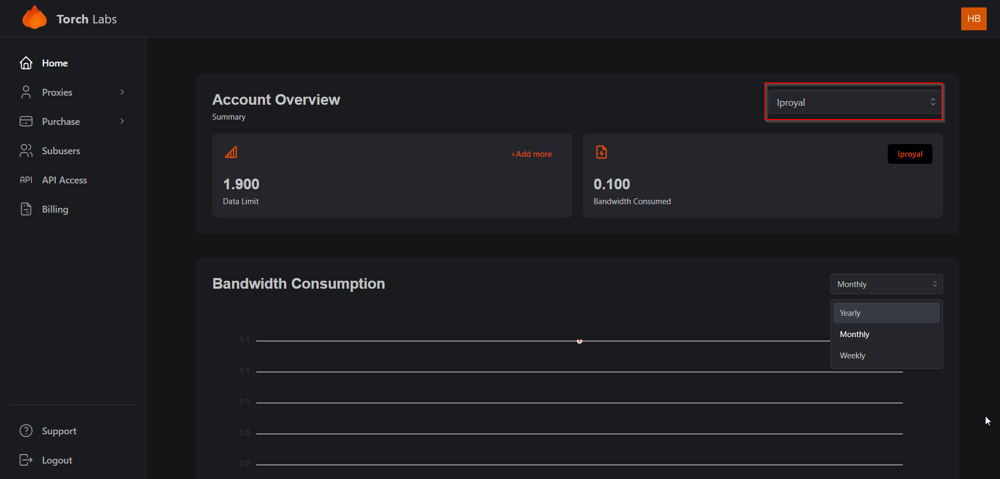

# Account Overview


This section on the Enterprise Dashboard presents the Residential Account Overview, providing customers with a graphical representation of their usage. By selecting their desired plan, customers can easily visualize their bandwidth consumption for review.


1. You can select the overview based on the provider

<figure><figcaption></figcaption></figure>

2. Bandwidth consumption can be generated weekly, monthly and yearly. The data will be depicted on a graph under bandwidth consumption section.

<figure><figcaption></figcaption></figure>
