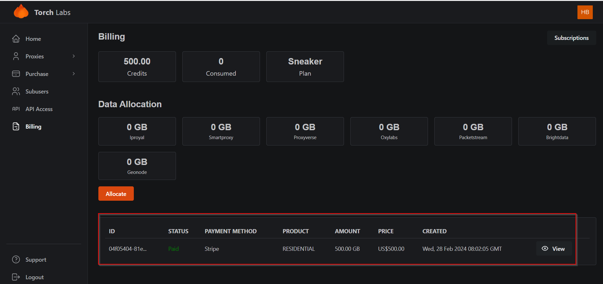

# Data Allocation

1. Click on the "Billing" tab

<figure><figcaption></figcaption></figure>


The data allocation section reflects the number of GBs allocated for each provider.


2. Click on the "Allocate" button

<figure><figcaption></figcaption></figure>


Here you can use the credits purchased to allocate the data for each provider&#x20;


3. Then you can allocate the data to the relevant provider.&#x20;


If you already have purchased credit, you can view the available credits here)


<figure><figcaption></figcaption></figure>

4. Finally, click the save button.

<figure><figcaption></figcaption></figure>


Furthermore, you can access the list of all the residential purchase orders


<figure><figcaption></figcaption></figure>
