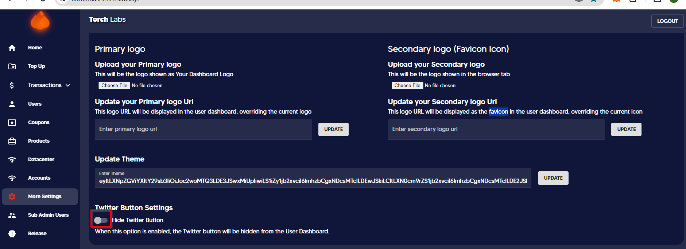

# Manage Subscription


This guide will help you set up subscription management within Stripe and will help you customize the functionality of the customer portal.


1. Click on the "Billing" tab

<figure><figcaption></figcaption></figure>

2. Click on the Subscription button

<figure><figcaption></figcaption></figure>

3. Then you can view all the residential and ISP subscription products

<figure><figcaption></figcaption></figure>

4. Click on the Manage subscription

<figure><figcaption></figcaption></figure>

5. Here you can select the plans and cancel as you want.

<figure><figcaption></figcaption></figure>
