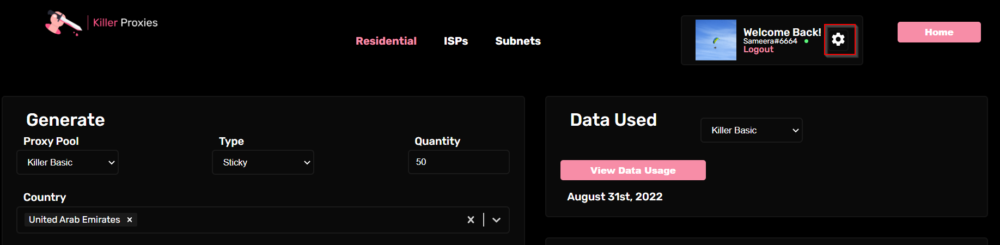

# 🖱 Access user settings


This guide will help you to find the access to Other Setting on User Dashboard.


_Go to User Dashboard and click on the gear icon to find the other settings._

<figure><figcaption></figcaption></figure>

Following are the other settings and click on the link to be directed to relevant guide.

* Setting up the Default Country&#x20;


[setting-up-the-default-country.md](setting-up-the-default-country.md)


* Updating Proxy Credentials


[updating-proxy-credentials.md](updating-proxy-credentials.md)


* Managing Subscription and Billing


[customer-subscription-portal.md](customer-subscription-portal.md)

