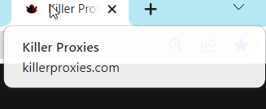

# 🛃 Custom Pools

This feature will help you to generate specific (selected) countries at the same time when generating proxies.&#x20;

1. Go to Customer dashboard and select countries to generate the proxies from. For an example choosing United States , United Kingdom , Germany and United Arab Emirates.
2. Then generate the proxies (i.e. Generate 100 proxies and customers get 25 each from the selected countries)

<figure><figcaption></figcaption></figure>
