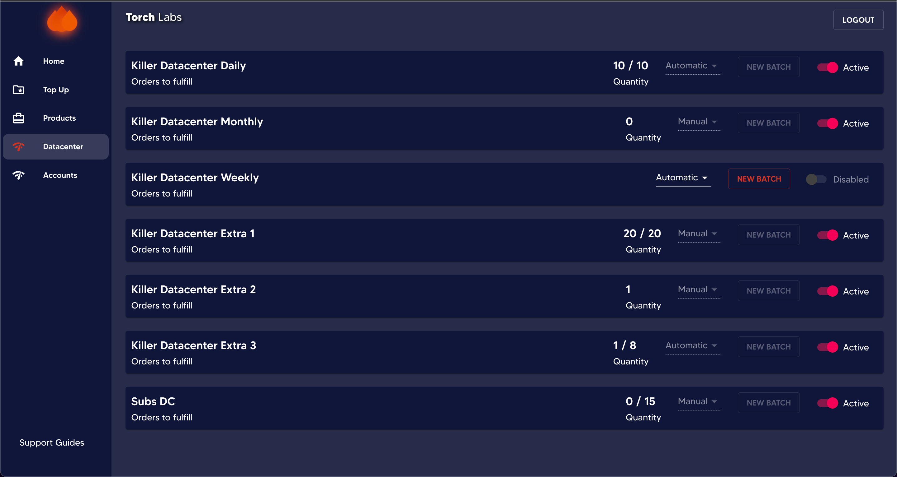
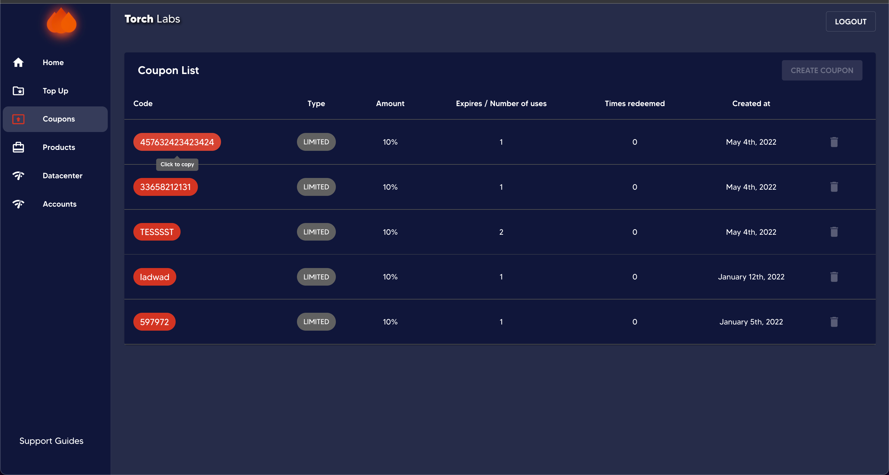
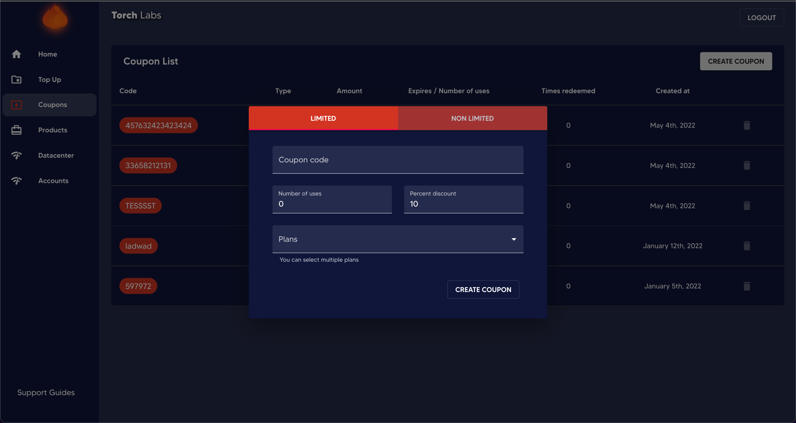
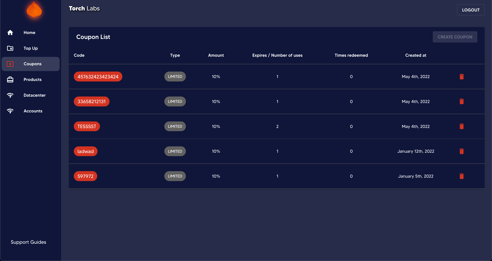

# 🎓 Proxy Generation


This section will guide you regarding the options and functions available on user dashboard when generating proxies.&#x20;

Our dashboard provides customers with a range of options for generating different formats, which is great for flexibility. Additionally, the ability to target proxies by country, state, and city allows customers to optimize the proxy usage for specific geographic locations. This can be particularly useful for businesses that have a strong local presence and need to gather data from specific regions. Overall, these features provide customers with greater control and customization options, which can ultimately lead to more efficient and effective use of proxies.


1. Go to User Dashboard

<figure><figcaption></figcaption></figure>

2\. Click on the drop down of Proxy Pool and select the required provider.

<figure><figcaption></figcaption></figure>

3\. Select the Proxy type (i.e. Sticky or Rotating)

<figure><figcaption></figcaption></figure>

4\. Then enter the number of Proxies to be generated.

<figure><figcaption></figcaption></figure>

5\. Select the SSL option. (This option is still available for Packetstream / Basic proxies only) Selecting _Yes_ would make you have proxies with a secure session where the proxies includes http / https in the URL domain.

<figure><figcaption></figcaption></figure>

6\. Select the country. Now you have the ability to choose multiple countries and generate custom pools.

<figure><figcaption></figcaption></figure>

6.1 If you select the country as USA (United States of America) then you get the option of clicking on _Advance Settings_ only for Oxylabs , Smart and IPRoyal.&#x20;

<figure><figcaption></figcaption></figure>

6.1.1 If you select IPRoyal as the Proxy pool and select the country as USA, it is able to generate state level proxies by clicking _Advance settings._

<figure><figcaption></figcaption></figure>

6.1.2 If you select Oxylabs or Smart as the Proxy pool and select the country as USA, it is able to generate either state level and city level proxies by clicking _Advance settings._ But it is not possible to select both state and city. Once you select the State, automatically the city selection gets disabled and vice versa.

<figure><figcaption></figcaption></figure>

7\. Once all the selections are done, click _Generate._

<figure><figcaption></figcaption></figure>
