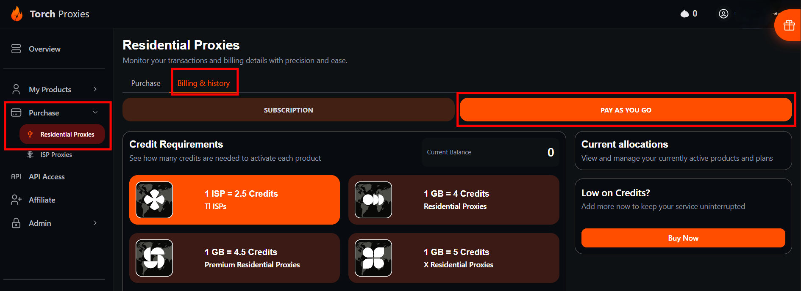
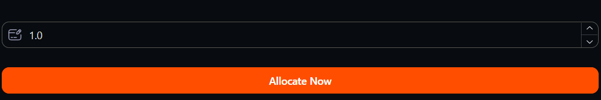
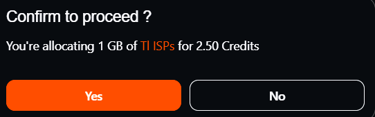
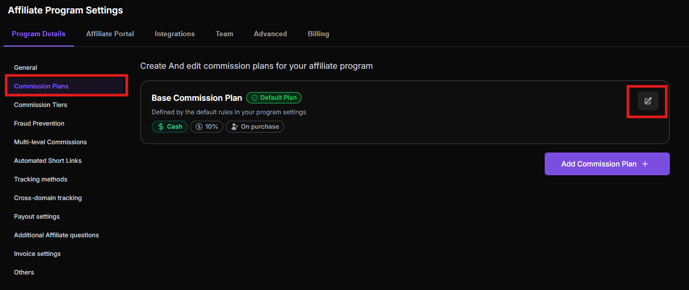

# 💲 Referly Campaign Setup Guide

***

### Introduction

This guide walks you through the complete process of setting up and launching an affiliate campaign on Referly (also known as Push Lap Growth). By the end of this guide, you will have a fully configured, active affiliate campaign with tracking, commission rules and a live affiliate portal.

**Before you begin**, ensure:

* A Referly account has been created at referly.so
* Email verification is complete

***

### Step 1: Access the Campaign Dashboard

After signing in, you will land on the main Referly dashboard. The central hub for managing affiliate programs, affiliates, referrals and payouts.

**To navigate to the Campaign Dashboard:**

1. Log in at referly.so/sign-in
2. From the left-hand navigation menu, locate the **Campaigns** section
3. Click on the campaign name or select **"Campaign Settings"** to open the configuration panel

The dashboard displays an overview of key metrics including active affiliates, total clicks, referrals and conversions, and revenue generated.

<figure><figcaption></figcaption></figure>

***

### Step 2: Open Campaign Settings

The **Campaign Settings** panel is where all core configuration lives - including commission rules, affiliate portal settings, tracking options and branding.

**To access Campaign Settings:**

1. From the dashboard, click the campaign name in the left sidebar
2. Select **"Campaign Settings"** from the dropdown or submenu
3. The Campaign Settings panel opens, displaying multiple configuration tabs:
   * **General** - Campaign name, description, and basic settings
   * **Commission Plans** - How affiliates are rewarded
   * **Integrations** - Payment and platform connections
   * **Affiliate Portal** - Branding and portal customization
   * **Tracking** - Link and cookie settings

<figure><figcaption></figcaption></figure>

***

### Step 3: Configure General Campaign Details

The **General** tab contains the foundational details of the affiliate program.

**Required fields to complete:**

1. **Campaign Name** - Enter a clear, descriptive name (e.g., "Proxies Affiliate Program")
2. **Campaign Description** - Write a short description affiliates will see when they join
3. **Landing Page URL** - Enter the business website URL where affiliates will send traffic

**Recommended settings:**

* Affiliate Approval: **Manual approval** (recommended for program quality control)

4. Click **Save** to confirm the general settings

<figure><figcaption></figcaption></figure>

***

### Step 4: Set Up a Commission Plan

The **Commission Plans** tab determines how affiliates earn money for successful referrals.

**To configure the commission plan:**

1. Navigate to **Campaign Settings → Commission Plans**
2. The **Base Commission Plan** is displayed at the top - this is the default plan all new affiliates are assigned to automatically
3. Click **"Edit"** next to the Base Commission Plan

**Configure the following fields:**

* **Commission Type** - Select **Percentage-Based** (recommended): Affiliates earn a percentage of each sale they refer (e.g., 15% per sale)
* **Commission Trigger** - Select **When a customer makes a purchase**
* **Products** - Select **All Products** to apply commissions to everything
* **Payment Duration:**
  * For one-time purchases: select **"One-time payout."**
  * For subscriptions: select **Recurring** and specify the number of months (e.g., 12 months)

4. Click "**Save Commission Plan."**

> **Note:** The Base Commission Plan cannot be deleted - it is the default for all new affiliates. Additional custom plans can be created for specific affiliates later.

<figure><figcaption></figcaption></figure>

<figure><figcaption></figcaption></figure>

***

### Step 5: Connect Integration \[Stripe]

To fetch your products automatically and set up referral tracking, please connect your product integration. Click the **‘Connect Integration’** button on the right. Once connected, your products/plans will appear here and you can select which ones this referral program applies to.

#### Click "Connect Integration."

1. In the orange warning banner that reads _"No product integration connected,"_ click the **Connect Integration** button on the right side.&#x20;

<figure><figcaption></figcaption></figure>

#### Select Stripe as the integration

2. From the list of available integrations, choose **Stripe**. You may be prompted to log in to your Stripe account or enter an API key to authorize the connection.

<figure><figcaption></figcaption></figure>

#### Authorise the Stripe connection

3. Complete the OAuth flow or paste your Stripe Restricted API key (with read access to Products and Prices). Confirm the connection - the orange banner should disappear once successful.

<figure><figcaption></figcaption></figure>

<figure><figcaption></figcaption></figure>

#### Search and assign products/plans

4. Use the **"Customer buys any of these products/plans"** search field to find your Stripe products. Leave it blank to apply the commission to all products, or select specific ones to target.

<figure><figcaption></figcaption></figure>

#### Confirm commission settings and save

5. Verify your **Commission Frequency** (Recurring Basis is selected) and **Commission Type** (Percentage is selected) match your program requirements, then save the plan.

<figure><figcaption></figcaption></figure>

***

### Step 6: Customize the Affiliate Portal

The **Affiliate Portal** is the branded interface where affiliates log in to view referral links, track earnings, and monitor performance.

**To configure the Affiliate Portal:**

1. Navigate to **Campaign Settings → Affiliate Portal**
2. Complete the following fields:
   * **Logo** - Upload the company logo (recommended: 200×60px, PNG format)
   * **Brand Color** - Set the primary color using a hex code (e.g., `#4F46E5`)
3. Click **Save** to apply the customization

> **Tip:** A well-branded affiliate portal improves affiliate trust and signup conversion rates.

<figure><figcaption></figcaption></figure>

<figure><figcaption></figcaption></figure>

Complete the following fields:

* **Custom Title** - This title should briefly summarize the purpose so users can quickly recognize what the configuration is for.
* **Custom Description** - A detailed explanation that provides more context about the title.&#x20;

Click **Save** to apply the changes.

<figure><figcaption></figcaption></figure>

***

### Step 7: Configure Tracking Settings

Proper tracking setup ensures referral clicks and conversions are accurately attributed to the correct affiliates. This must be completed before launching the campaign.

**To configure tracking:**

Set the **Affiliate URL Tracking Method** to:

**`aff`**

This is extremely important. Using any other keyword may prevent referral tracking from functioning correctly on your dashboard.

> **Important:** You must select **“aff”** from the available keyword options.
>
> Choosing any other keyword may prevent the Affiliate Program from functioning correctly on your dashboard, as referral tracking depends on this exact setting.

<figure><figcaption></figcaption></figure>

***

### Step 8: Set Up Cash Payout Methods

1. **Navigate to Program Settings**

* From the dashboard, click "Programs" in the left-hand sidebar.
* Select the referral program you want to configure payouts for.
* Click the "Settings" tab within the program. 

2. **Open the Payout Methods Section**

* Within Settings, locate and click the "Payouts" or "Rewards" section.
* Look for a sub-section labeled "Payout Methods" or "Cash Payouts."
* Click "Add Payout Method" or "Manage Methods" to begin setup. 

3. **Select 'Cash' as the Payout Type**

* From the list of reward types (Gift Cards, Discounts, Cash, etc.), select "Cash".
* Choose your preferred delivery method — options typically include Bank Transfer, PayPal or Stripe.
* Click "Next" or "Configure" to proceed.

4. **Enter Payout Configuration Details**

* Set the minimum payout threshold (e.g., minimum $10 before withdrawal).
* Configure the payout currency to match your program's region.
* If required, enter your organization's payment processor credentials (API keys or account ID).
* Set any payout frequency rules (e.g., instant, weekly, monthly).

5. **Save and Activate the Payout Method**

* Review all entered details carefully before saving.
* Click "Save" or "Activate" to enable the cash payout method.
* A confirmation message should appear indicating the method is now active.

<figure><figcaption></figcaption></figure>

6. **Test the Payout Setup**

* Use a test referral account (if available) to simulate a payout request.
* Confirm the payout appears correctly in the "Pending Payouts" or "Transactions" section.
* Verify the referrer receives a notification or confirmation of their payout.

`💡 Note: If payout options appear greyed out or unavailable, verify that your payment processor integration is connected under Settings > Integrations. Contact Referly support if issues persist.`

***

### Step 9: Invite Affiliates to the Program

With tracking live and the campaign configured, the next step is bringing affiliates into the program.

**To invite affiliates:**

1. From the main dashboard, navigate to the **Affiliates** section in the left sidebar
2.  Click **Invite Affiliates** or **Add Affiliate** 

    <figure><figcaption></figcaption></figure>
3.  Choose one of the following methods: \
    **Option A - Share the Signup Link:**

    * Share it via email, social media or the business website
    * Affiliates click the link, complete the signup form, and await approval

    **Option B - Manually Add an Affiliate:**

    * Click **"Add Affiliate."**
    * Enter the affiliate's name and email address
    * Click **Send Invitation** - the affiliate receives an email with login instructions
4. Affiliates appear in the **Affiliates** list with **Pending** status
5. Review each application and click **"Approve"** to activate their account

After approval, the affiliate automatically receives:

* Their unique referral tracking link
* Access to the branded affiliate portal
* A personal dashboard showing clicks, referrals, and earnings

<figure><figcaption></figcaption></figure>

***

### Step 10: Verify the Campaign is Active

Before promoting the program publicly, verify that all components are working correctly.

**Verification checklist:**

1. Go to **Campaign Settings → General** and confirm the campaign status shows **Active**
2. Open the Affiliate Signup Link in a new browser tab and confirm the signup form loads correctly
3. Log in to the affiliate portal as a test affiliate and confirm:
   * The referral link is visible and copyable
   * The dashboard loads without errors
4. Click the test referral link and complete a test purchase on the business website
5. Return to the Referly dashboard and check **Tracking & Sales** — confirm the test referral was recorded

**Expected results:**

* A referral entry appears in the **Referrals** section
* A commission is calculated and shown in the **Commissions** section
* The test affiliate's dashboard shows the click and referral

> **If tracking is not recording:** Return to **Campaign Settings → Tracking** and use the **Test Tracking** tool to diagnose the issue. Confirm the tracking script is installed correctly on the website.

<figure><figcaption></figcaption></figure>

***

### Summary: Campaign Setup Checklist

| Step | Task                                |
| ---- | ----------------------------------- |
| 1    | Accessed the Campaign Dashboard     |
| 2    | Opened Campaign Settings            |
| 3    | Configured General campaign details |
| 4    | Established a Commission Plan       |
| 5    | Connected Integration \[Stripe]     |
| 6    | Customized the Affiliate Portal     |
| 7    | Configured Tracking Settings        |
| 8    | Established Cash Payout Methods     |
| 9    | Invited Affiliates to the Program   |
| 10   | Verified the Campaign is Active     |

***

### Next Steps

Once the campaign is live and verified:

* **Share the Signup Link** across email lists, social media, and the business website
* **Monitor performance** weekly from the main dashboard
* **Review and approve** incoming affiliate applications promptly
* **Process payouts** when affiliate commissions reach the minimum payout threshold

For additional help, visit the Referly Help Center at [referly.so/guides](https://www.referly.so/guides) or reach out via Discord Ticket.
