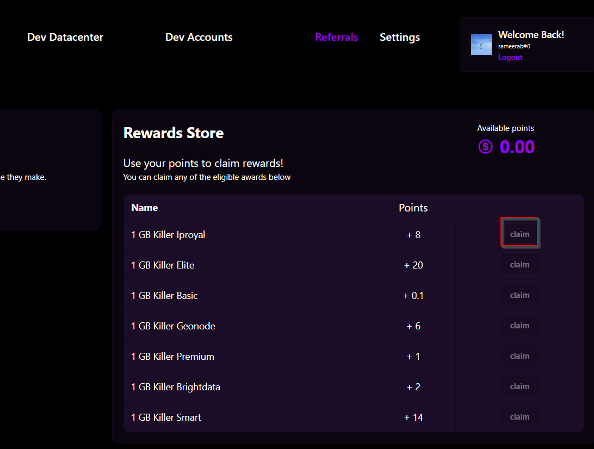

# 🫐 Referral System


Customers can create a referral link in the customer dashboard to share with others. This is applicable only for the initial purchase by newly joined users. When individuals use this link to register and purchase a residential plan for the first time, the customer will receive credits corresponding to the rate of the chosen plan. These credits can be redeemed for data and are applicable only for the initial purchase by newly joined users. This is a feature flag and admin dash customers can enable or disable it in more settings section, it only works for residential plans for now.

Introduction to the Referral System

Welcome to our Referral System, a program designed to reward your users for sharing your services with others! By participating, your users can earn credits that can be redeemed for valuable data, simply by referring new customers to our platform.This is applicable only for the initial purchase by newly joined users. When individuals use this link to register and purchase a residential plan for the first time, the customer will receive credits corresponding to the rate of the chosen plan. These credits can be redeemed for data and are applicable only for the initial purchase by newly joined users.

How It Works:

* Generate Your Referral Link: Easily create a referral link from your customer dashboard.
* Share the Link: Share your unique link with friends, family, or anyone interested in our services.
* Earn Credits: When a new user signs up and makes their first purchase using your link, you earn credits based on our product rates.
* Redeem Credits: Use the credits you've earned to get data, according to our redemption rates.

Our referral system is a win-win, helping your users save on data needs while supporting your community growth.


### Generating the Referral Link

1. Go to _More Settings_ and enable Referrals

<figure><figcaption></figcaption></figure>

2. Go to Customer Dashboard and click on _Referrals_

<figure><figcaption></figcaption></figure>

3. Click on the _Generate Referral link_

<figure><figcaption></figcaption></figure>

3.1 This is what the link looks like after following step 3.

<figure><figcaption></figcaption></figure>

### Setting Product Rates & Redemption Rates


**Redemption Rates:**

Redemption rates determine how many credits you need to redeem (use) to get a certain amount of data. Think of credits like points you earn from referrals. When you have enough points, you can exchange them for data. The redemption rate tells you how many points are needed to get 1GB of data. For example, if the redemption rate is set to 10 credits per GB, you need 10 points to get 1GB of data.

**Product Rates:**

&#x20;Product rates determine how many credits you earn when someone uses your referral link to make a purchase. When you share a referral link and a new customer uses it to buy a data plan, you earn points. The product rate specifies how many points you get for each gigabyte (GB) of data they buy. For instance, if the product rate is set to 5 credits per GB and the new customer buys a 2GB data plan, you earn 10 credits (5 credits per GB x 2GB).


1. Go to other settings and Enter the product rates. The rates you enter here will be the number of credits per GB you allocate when someone uses the referral link and refers to another person.&#x20;
2. Next, you need to enter the redemption rates and that will be the number of credits per GB to be redeemed in purchasing data.


The appropriateness of sharing the referral link depends on your intended purpose and the sales strategy you are employing.

For instance, setting a high product rate and a low redemption rate may incentivize people to share the link more frequently. This is because they can earn more credits, allowing them to redeem a greater amount of GBs. When establishing these rates, consider factors such as:

Factors to consider in determining product/redemption rates

* Average initial data purchase&#x20;
* Average sales&#x20;
* Ability to share the referral link&#x20;
* Encouraging the sales of a particular product&#x20;
* Target audience
* Seasonal trends
* Referral program goal (Increasing sales, promotion, expanding customer base, etc.)

You can adjust the rates according to your specific purpose and goals.


<figure><figcaption></figcaption></figure>

### Initial Purchase

1. Initial purchases can be made by using the generated referral link sent by another user. Once the received link is clicked, it will automatically be directed to the particular user dashboard. The initial purchase that the user is going to make, would add a certain amount of credits depending on the product rates entered under the _Other Settings_.

<figure><figcaption></figcaption></figure>

2. The above purchase would be reflected as follows on the admin dashboard

<figure><figcaption></figcaption></figure>

3. Total Credits would be reflected as follows under the _Reward store_ section in the Customer Dashboard.


In the Reward Store, you can see how many points you've earned. Additionally, under each provider, the redemption rates you entered in the admin dashboard are displayed. Consequently, you can claim data based on the available points. Please note that only 1GB can be claimed at once.


<figure><figcaption></figcaption></figure>

> Refer to the following scenario for further understanding.
>
>
>
> A - Referral link generator&#x20;
>
> B - The individual making the initial purchase using the shared referral link&#x20;
>
> Product rate for Packetstream - 10 credits per GB
>
> If "A" generates the link and shares it with "B", and then "B" purchases 1GB of Packetstream using the referral link, this purchase adds 10 credits under "A". According to the number of credits per GB entered under redemption rates would decide how many credits need to be earned so that "A" can use these credits to buy any residential product if they meet the required credit threshold for purchasing residential products. This policy is applicable only for the initial purchase.
>
> In this scenario, if "B" generates another referral link for themselves and shares it with a person named "C," then the initial purchase made by "C" will bring credits for "B"

4. Click on the _Claim_ button to claim the data.

> _Claim_ button is displayed active only if you have enough available point to claim the data.

<figure><figcaption></figcaption></figure>

5. You can check the referred friends and reward history in this section

<figure><figcaption></figcaption></figure>
