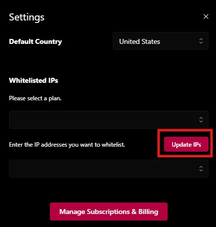

# How to remove whitelisted IPs

### How to Remove Whitelisting

**Step 1: Open the Settings Panel**

* Navigate to the **Settings** section in your proxy dashboard.
* Locate the **Whitelisted IPs** section.

<figure><figcaption></figcaption></figure>

<figure><figcaption></figcaption></figure>

**Step 2: Select a Proxy Product**

* Under "**Please select a plan,"** click the drop-down menu.
* Choose the proxy product from which you want to remove whitelisted IPs.

<figure><figcaption></figcaption></figure>

**Step 3: Remove the IP Addresses**

* In the **Whitelisted IPs** list, find the IP address you want to remove.
* Click the **Delete** or **Remove** icon/button next to that IP.
* Repeat for any other IP addresses you wish to remove.

<figure><figcaption></figcaption></figure>

**Step 4: Update Whitelisted IPs**

* Click the **Update IPs** button to save your changes.
* The selected IPs will no longer be whitelisted for the chosen proxy product.

<figure><figcaption></figcaption></figure>

**Step 5: Confirmation**

* A confirmation notification will appear at the **bottom-left corner** of your screen, indicating that your IP whitelist has been successfully updated.

<figure><figcaption></figcaption></figure>

