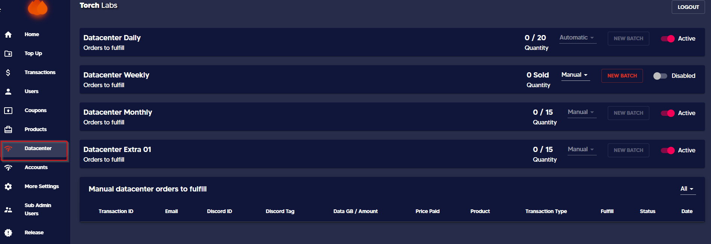
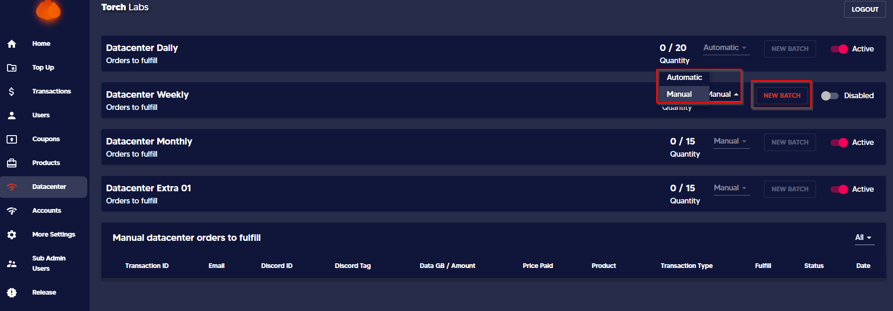

# 🪜 Add an expiration date to a batch


This guide will help you to add an expiring date for the automatically and manually generated ISPs.


1. Go to the admin dashboard and then click on the _**Datacenter**_ tab&#x20;

<figure><figcaption></figcaption></figure>

2\. Select the mode of release from the dropdown list of Automatic and Manual

<figure><figcaption></figcaption></figure>

#### Automatic Release

Once you update the IPs then you can select the expiry date of the IPs along with the time depending on the product.

<figure><figcaption></figcaption></figure>

#### Manual Release

Here you have the option of setting the expiry date along with the time depending on the product.

<figure><figcaption></figcaption></figure>

_The expiry date of the orders is displayed on the User Dashboard as follows_

<figure><figcaption></figcaption></figure>
