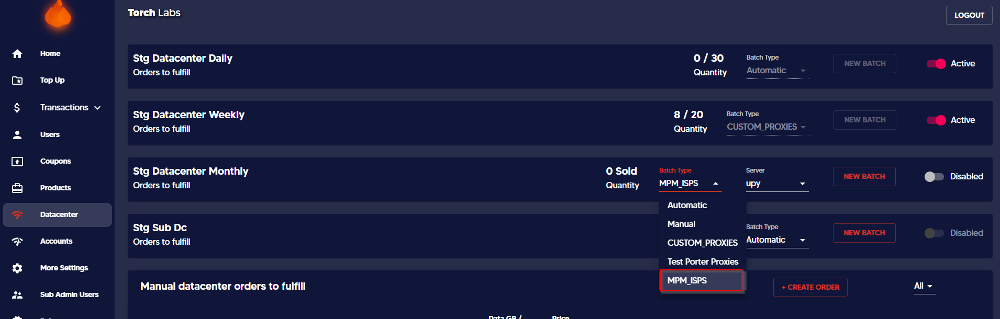

# ⚓ Creating MPM ISP API Batch


This section will guide you on creating an ISP API batch for a registered API. Only one ISP API can be assigned to multiple products / batches.&#x20;


Before doing the steps make sure the API is registered and refer to the following guide for registering the API.&#x20;


[adding-and-removing-isp-api.md](../../more-settings/adding-and-removing-isp-api.md)


1. Go to _Datacenter_ tab on Admin Dashboard.

<figure><figcaption></figcaption></figure>

2\. Click on the dropdown list before the new batch and select MPM ISPs from the list.

<figure><figcaption></figcaption></figure>

3\. Then select the relevant server from the dropdown list.

<figure><figcaption></figcaption></figure>

If you precisely registered, all the APIs would appear under the dropdown list including _MPM Proxies_. ISP API batch types for all the customers are now shown as MPM Proxies. Accordingly, choose the relevant option when creating the new batch.

At this stage, it gives the ability to assign one product/batch and deliver the stock in one batch.

4\. Now you can add a stock limit and duration for expiration. Then tick confirm and select launch. At this point, the combination of the batch has to be equal to or more than the stock limit.

<figure><figcaption></figcaption></figure>
