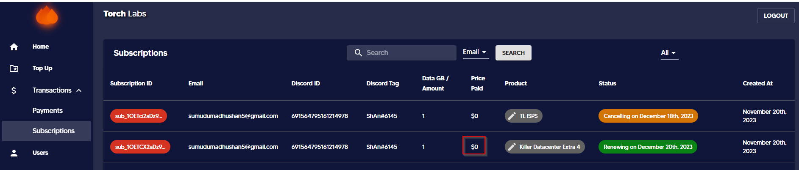
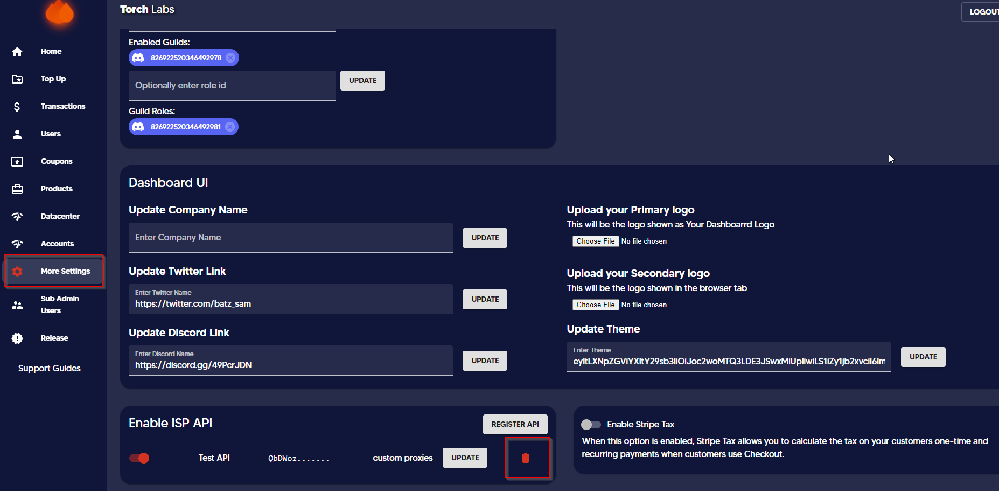

# 📂 Creating manual orders for ISPs / Accounts


This section will guide you on how to create a manual order for ISPs/ Accounts. This is similar to add/ remove data to people using the admin dashboard for residential providers.



Internal notes are only visible by admins and not the users


1. Go to Datacenter / Account tab on admin dashboard

<figure><figcaption></figcaption></figure>

2\. Select _Create Order_

<figure><figcaption></figcaption></figure>

3\. Select the user that the accounts / ISPs to be added for

<figure><figcaption></figcaption></figure>

4\. Select the product that needs to be added

<figure><figcaption></figcaption></figure>

5\. Paste the ISPs / Account list here

<figure><figcaption></figcaption></figure>

6\. Set the expiration date or the number of days from creation date to expiration date for the pasted list.

<figure><figcaption></figcaption></figure>

7\. Admin can add an internal note here as required

<figure><figcaption></figcaption></figure>

7.1 That internal note would be displayed in Transactions tab under payment sub-tab

<figure><figcaption></figcaption></figure>

8. Tick confirm and then select add.

<figure><figcaption></figcaption></figure>

