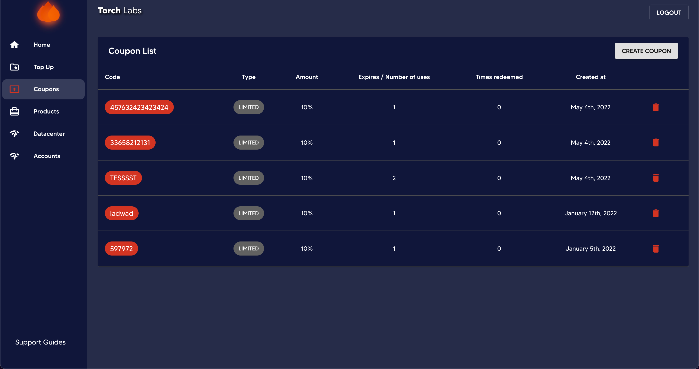

# ⚕ Editing incomplete transactions


This guide will help you to edit the incomplete transactions in Datacenter and Accounts tabs.


> Please refer to the transaction types to have a further understanding regarding incomplete transactions.


[transaction-status.md](../general-settings/transaction-status.md)


1. Go to Datacenter / Accounts tab on Admin Dashboard.

<figure><figcaption></figcaption></figure>

2\. Select the incomplete transaction and click on the pencil icon before the product type with reference to that particular transaction.

<figure><figcaption></figcaption></figure>

3\. Then you can edit the proxies either by editing them or replacing with new ones.

<figure><figcaption></figcaption></figure>

4\. Thereafter you can set an expiration date and time.

<figure><figcaption></figcaption></figure>

5\. At last tick _Confirm_ and click save.

<figure><figcaption></figcaption></figure>
