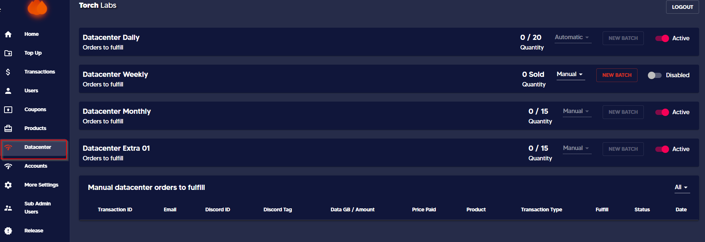
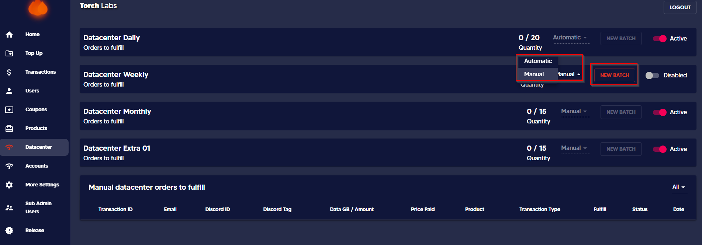

# 🪜 ISP Expiration Date


This guide will help you to add an expiring date for the automatically and manually generated ISPs.


1. Go to admin dashboard and the click on _**Datacenter**_ tab&#x20;

<figure><figcaption></figcaption></figure>

2\. Select the mode of release from the dropdown list of Automatic and Manual

<figure><figcaption></figcaption></figure>

#### Automatic Release

Once you update the IPs then you can select the expiry date of the IPs as you with along with the time depending on the product.

<figure><figcaption></figcaption></figure>

#### Manual Release

Here you have the option of setting the expiry date along with the time depending on the product.

<figure><figcaption></figcaption></figure>

_Expiry date of the orders are displayed on the User Dashboard as follows_

<figure><figcaption></figcaption></figure>
