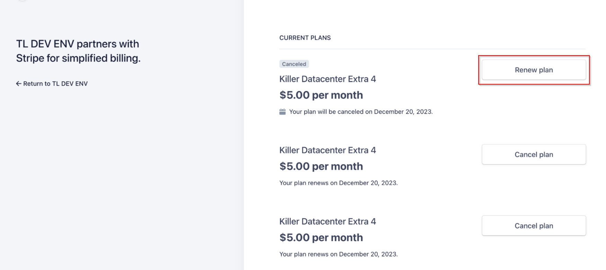

# ❔ How to renew a subscription after cancellation ?


After cancelling a subscription, you might need to renew it later. This function assists in renewing a cancelled subscription; however, the renewal must occur before the subscription's cancellation date.


1. Go to the subscription portal in the customer dashboard


[customer-subscription-portal.md](../../customer-dashboard/customer-subscription-portal.md)


2. Identify the required subscription to be renewed and click on it

<figure><figcaption></figcaption></figure>

3. Once this is complete , a webhook will be sent to your server as follows

<figure><figcaption></figcaption></figure>

4. The amount displayed as $0 on the admin dashboard for the renewal after cancellation signifies that it is merely an event intended to renew a cancelled subscription, rather than constituting a new transaction.

<figure><figcaption></figcaption></figure>


Renewal after cancellation differs entirely from the automatic renewal occurring for the subscription, which will be displayed in the usage breakdown. However, renewals after cancellation won't be listed as separate transactions in the usage breakdown. They will be indicated as "renewal after cancellation," while the transactions considered for the usage breakdown will appear as "Complete." To distinguish between these renewals easily, you can review the customer dashboard status.


<figure><figcaption></figcaption></figure>
