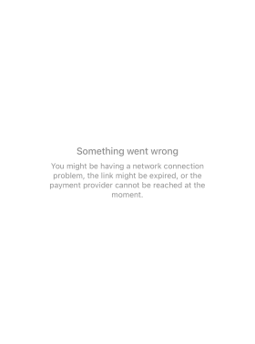

# ❔ How does Torch Labs prevent overselling on the dashboard ?

In the event that a user encounters the following error message on Stripe when attempting to purchase a product, it signifies an over-demand situation where multiple individuals are attempting to purchase the same product simultaneously.

<figure><figcaption>
Stripe error message
</figcaption></figure>

In cases where there are multiple users attempting to purchase a product while the available stock is low and the number of users exceeds the available stock, our system will calculate the precise number of individuals who will be able to complete the purchase. This ensures that customers are not charged in the absence of available stock and prevents duplicate orders. As a result, the aforementioned error message will appear on Stripe.
