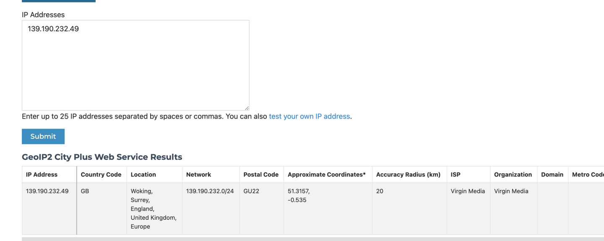

# ❔ How to check geolocation?


IP address geolocation refers to the process of identifying the physical location of a device or a network connected to the internet using its IP address. An IP address is a unique identifier assigned to a device that is connected to the internet.


To check the IP address geolocation, go to the following database site.



In this, all the proxies are showing the correct location and correct ISP.

Following is the database that Nike and all bot protection companies use to identify IP location

<figure><figcaption></figcaption></figure>

