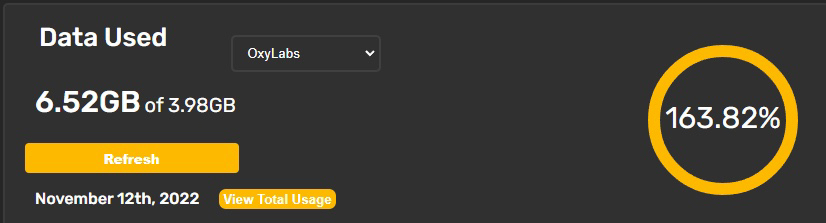
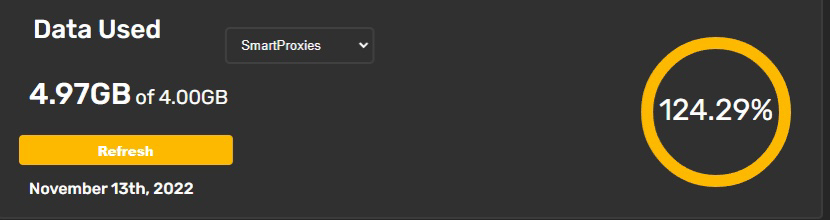

# ❔ What happens if someone overuses the data ?

This is actually normal. Sometimes customers can use extra data if they have their tasks running. However, you won't be charged for the extra data. We will cover all that.

Additionally, the next time when the customers purchase, their balance will be 0 so they won't get penalized for the extra usage.

<figure><figcaption></figcaption></figure>

 

<figure><figcaption></figcaption></figure>

