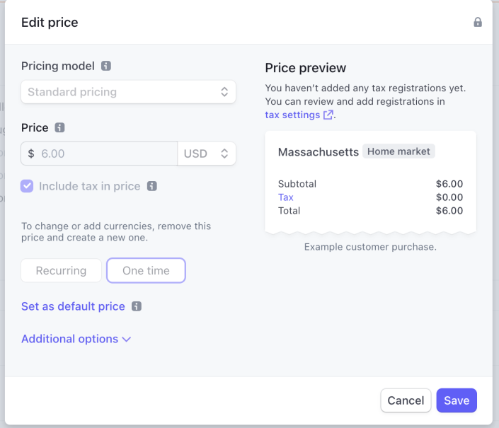

# ❔ Why is the customer ISP plan says can not checkout ?

The tax rates need to be enabled for the prices to allow the customers to checkout for the ISP plans.

<figure><figcaption></figcaption></figure>
