# How to Test Your Proxies using BPProxy

### **BPProxy Chrome Extension User Guide** 

#### **1. Installing the BPProxy Chrome Extension** 

**Step-by-step:**

1. Open Google Chrome.
2. Visit the Chrome Web Store.
3. Search for **"BPProxy"**.

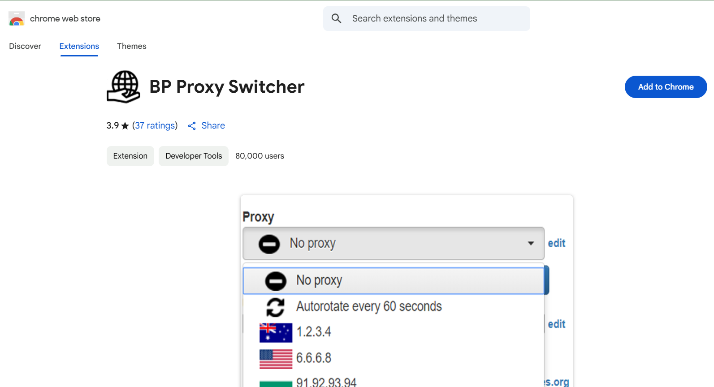

4. Click on the extension, then select Add to Chrome.

.png>)

5. Confirm by clicking Add extension. 

#### **2. Opening the Extension and Initial Setup** 

1. Click the **BPProxy icon** in your Chrome toolbar (top-right corner).

.png>)

2. A dropdown window will appear for proxy configuration.

.png>)

3. Click the **"Add Proxy"** or “**Edit**” button. 

#### **3. Adding a Proxy** 

Fill out the following fields:

* **Proxy Type**: HTTP, HTTPS, SOCKS4, or SOCKS5
* **Host**: IP address of the proxy
* **Port**: Usually 8080, 3128, or another depending on your provider
* **Username/Password** (if required): For authenticated proxies 

.png>)

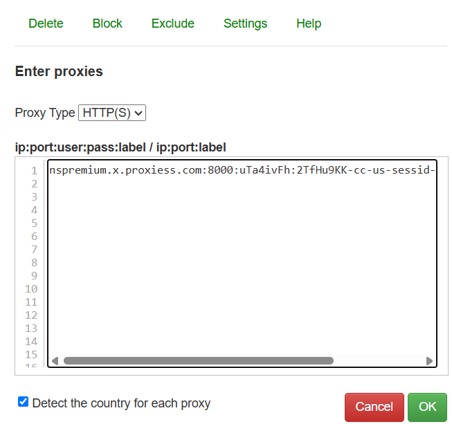

Then click **OK** to save. 

#### **4. Switching or Enabling a Proxy** 

1. After saving, your proxy will be listed.
2. To activate it, click the **toggle switch** next to the proxy.

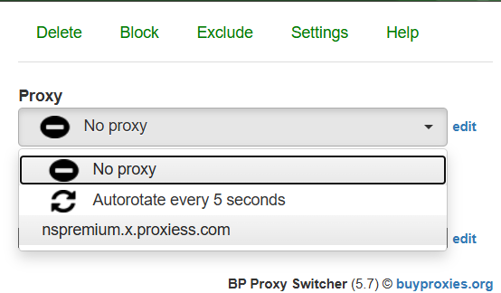

3. You’ll see the list of proxies that were added and select one from the drop down to **enable** the proxy active.

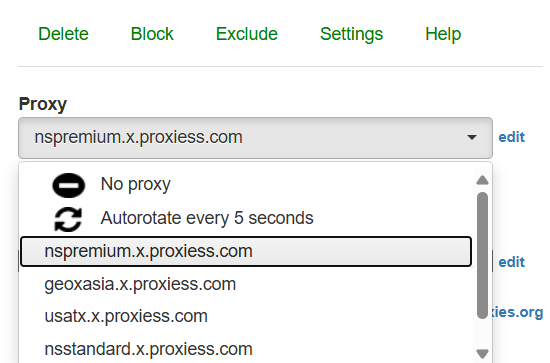 

#### **5. Testing If Your Proxy Works** 

**Method 1: IP Leak Test**

1. Visit[ https://ipinfo.io](https://ipinfo.io/) or[ https://whatismyipaddress.com](https://whatismyipaddress.com/).
2. Check the IP and location details.

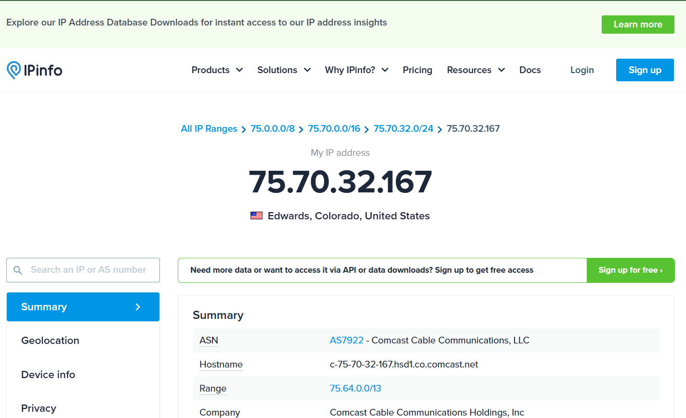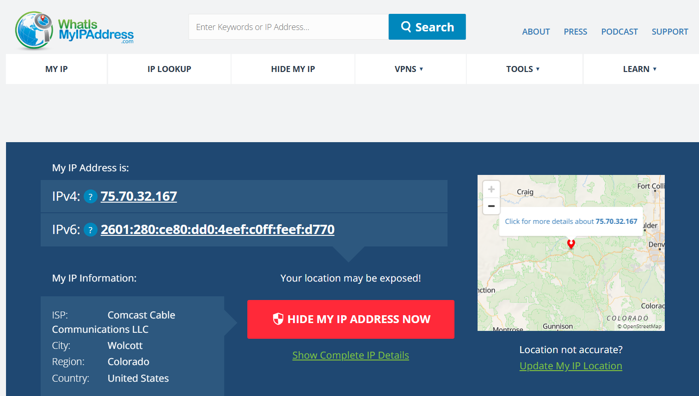 

3. If they match your proxy, it’s working. 

**Method 2: Speed & Anonymity Check**

Use a tool like:

* [https://iproyal.com/online-proxy-checker/](https://iproyal.com/online-proxy-checker/)
* [https://gologin.com/proxy-checker](https://gologin.com/proxy-checker) 

Paste in your proxy IP and port. Run the test to see latency, anonymity level, and more.

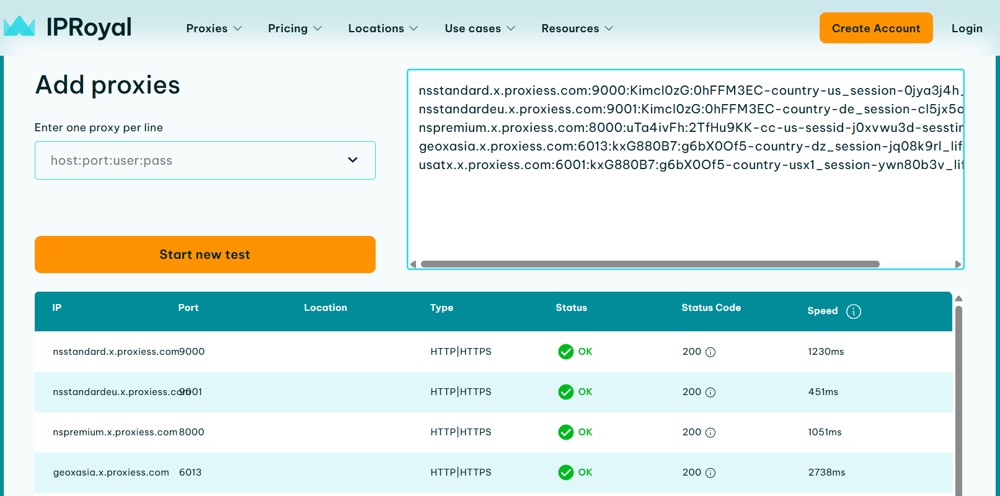

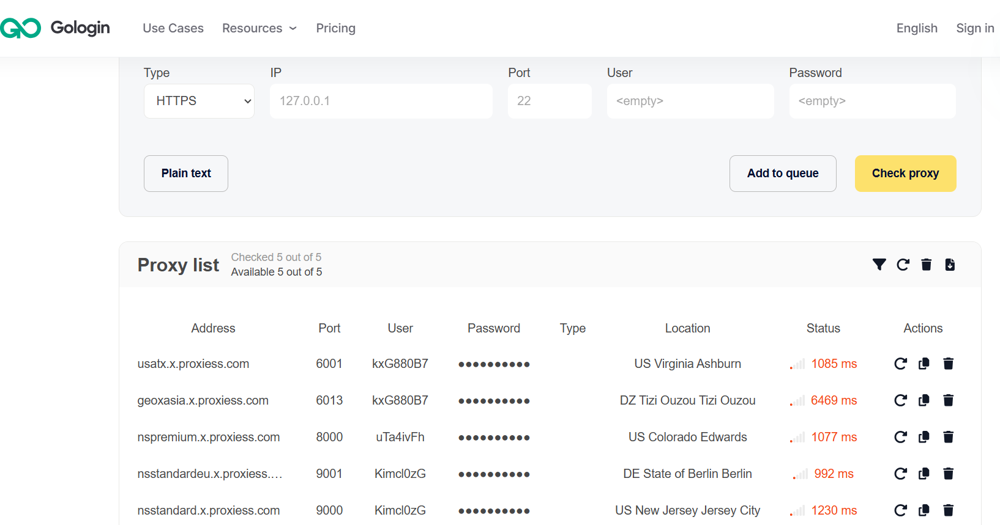

#### **6. Editing or Deleting a Proxy** 

* Click the **Edit** icon (pencil) to change details.

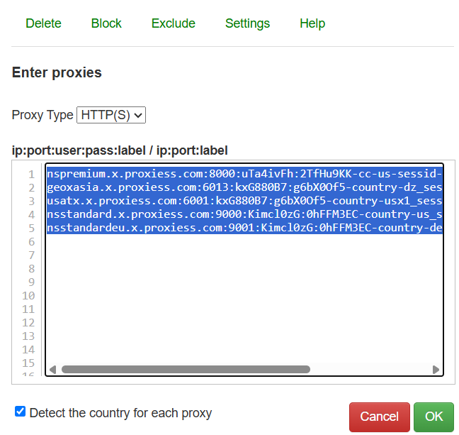

* Click the **Delete** icon to remove/delete the proxy.

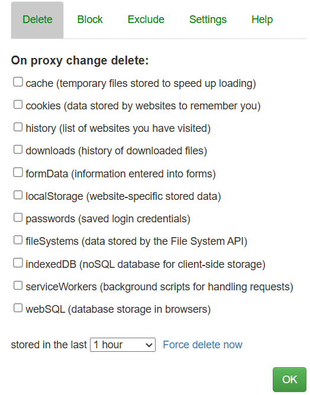

#### **7. Testing Proxies on Target Site** 

* Before deploying your proxies, test them against your target site to ensure compatibility, speed, and success rates. This helps you identify which proxies perform best and avoid wasting time on blocked or slow IPs.

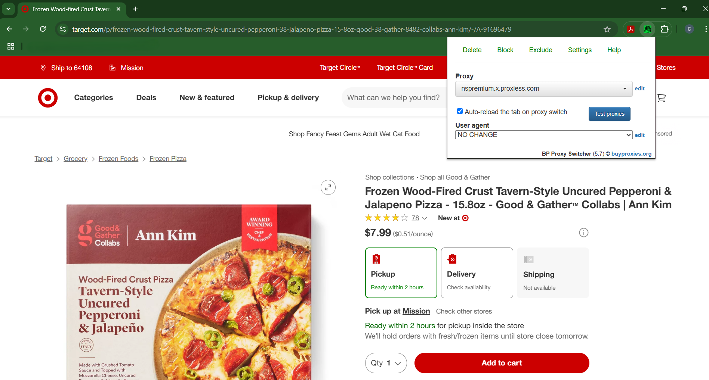

#### **Tips & Troubleshooting** 

* If websites don’t load after enabling a proxy, try:
  * Switching proxy types (HTTP vs SOCKS5)
  * Testing another proxy from your list
  * Ensuring the IP/port is active
* Avoid using multiple proxy extensions at once, as they may conflict.
* Always clear the browser cache when switching proxies for accuracy. 
