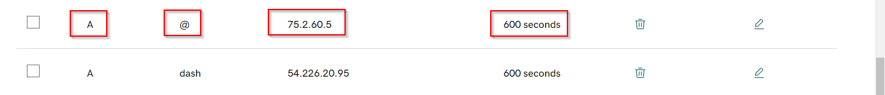

# ✂ Adding and Removing ISP API


This section will guide you on how to set up ISP API. When registering API, the Custom API is the one used for Tanmays Script while Porter Proxies is for the one given by porter proxies


1. Go to _Other Settings_ tab on Admin Dashboard

<figure><figcaption></figcaption></figure>

2\. Scroll down the page and click on _Register API_

<figure><figcaption></figcaption></figure>

3\. Fill the details such as Name , API end point , API Key. Then select  API type. Then click on Register


we currently only support API access from Tanmay and Porter Proxies. More integrations will be added later



Make sure to use only _http_ and not to use any _/_ symbol at the end of the API end point.


<figure><figcaption></figcaption></figure>

Once the API is registered you should be able to view them in the same location. Further you can create any number of APIs here.

<figure><figcaption></figcaption></figure>


If you want to remove an ISP API batch , click on the delete icon in front of the created ISP API batch in Other settings tab.


<figure><figcaption></figcaption></figure>


Customers can see now available proxies in registered API section.


<figure><figcaption></figcaption></figure>
