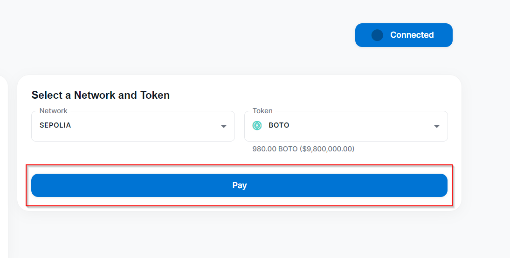

# 💱 Crypto Payments


This guide will lead you through the process of establishing cryptocurrency payments.&#x20;

_Cryptocurrency is a digital or virtual form of currency that utilizes cryptography for secure financial transactions and operates independently of a central bank._



We do not endorse platforms like Binance, Coinbase, OKX, or Bybit for exchanges. Our support is solely directed towards crypto wallets like MetaMask. If you lack a crypto wallet, you may obtain one by downloading a wallet extension from Google Chrome. Following this, you can transfer crypto from Binance to your wallet. Numerous options are at your disposal.

To receive payments, individuals must include their EVM wallet address, which remains consistent across Ethereum, Binance Smart Chain, and Polygon networks.



we support Ethereum (ETH) , Polygon (POL) and BNB Smart Chain, along with a variety of tokens to cater to your preferences.&#x20;


#### Supported networks and currency types

1. Ethereum Mainnet

<figure><figcaption></figcaption></figure>

2. Polygon

<figure><figcaption></figcaption></figure>

3. BNB Smart Chain

<figure><figcaption></figcaption></figure>

#### Enabling Crypto Currency

1. Go to the admin dashboard and select the _More Settings_ tab (then scroll down to the bottom of the page)

<figure><figcaption></figcaption></figure>

2. Click the _Enable Crypto Payments_ button

_When this option is enabled, users can see a popup when they checkout. In that popup, they will see payment options with crypto. By clicking that, users can checkout with crypto._

<figure><figcaption></figcaption></figure>

3. If you want you can disable the card payment option and keep only the crypto payment option available for the customers to pay (When this option is enabled, "Pay with Card" payment option will be hidden from the user dashboard)


Please note that this feature is optional, and we encourage customers to keep both card and cryptocurrency payment options available on the dashboard.


<figure><figcaption></figcaption></figure>

4. Then enter the _Receiving Wallet Address_ and click on the _Save_ button

_A receiving wallet address is required to enable this feature. Please ensure that you enter the correct wallet address. Adding an incorrect wallet address may result in the loss of funds, as they cannot be recovered._

<figure><figcaption></figcaption></figure>

#### Purchasing with Crypto Currency

1. the Go to customer dashboard and click on the _Purchase_ button&#x20;

<figure><figcaption></figcaption></figure>

2. Select the payment method

<figure><figcaption></figcaption></figure>

3. Click on the _Connect Wallet_ button

<figure><figcaption></figcaption></figure>

4. Select the relevant wallet and connect it

<figure><figcaption></figcaption></figure>


Please refer to the following video guide to identify the supported wallets.




5. Click on _the Pay_ button afterwards

<figure><figcaption></figcaption></figure>

6. Finally, click on the _Confirm_ button to complete the transaction

<figure><figcaption></figcaption></figure>

