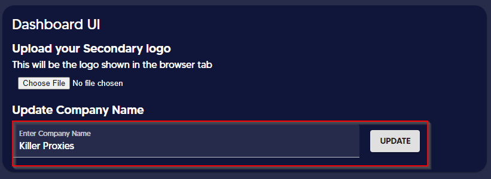

# 📛 Updating Company Name


This section will guide you to update your company name to appear as the title and footer name on the customer dashboard.


1. Go to Admin Dashboard and click on _More Settings_

<figure><figcaption></figcaption></figure>

2\. Enter the company name under the Dashboard UI section and click Update.

<figure><figcaption></figcaption></figure>

_The name will be updated in 02 places such as the Title name and the footer name._

**Title Name**

<figure><figcaption></figcaption></figure>

**Footer Name**

<figure><figcaption></figcaption></figure>
