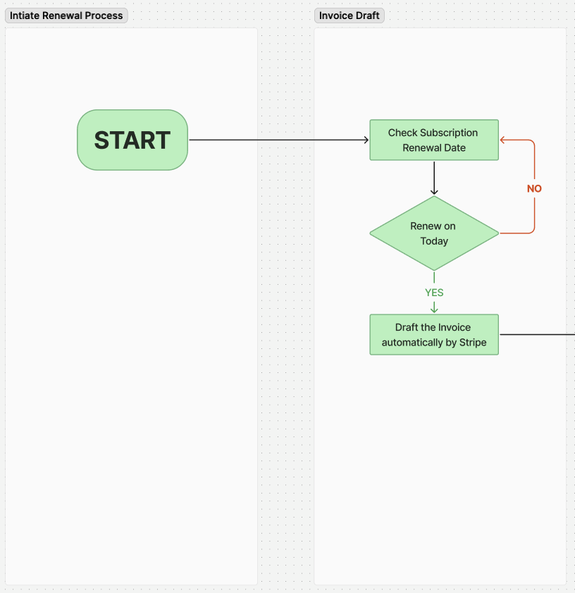

# 🛂 Updating Support Description


This section will guide you to update your Support description to appear on the user dashboard.


1. Go to Admin Dashboard and click on More Settings

<figure><figcaption></figcaption></figure>

2. Enter the description under the Update Support Description field in the Dashboard UI section and click Update.

<figure><figcaption></figcaption></figure>

_The Support description will appear on the user dashboard as follows_

<figure><figcaption></figcaption></figure>

