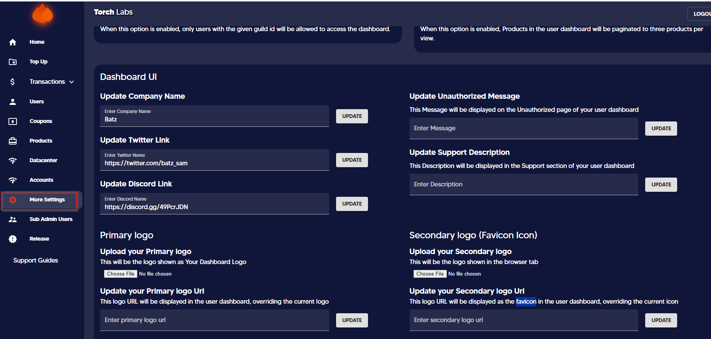
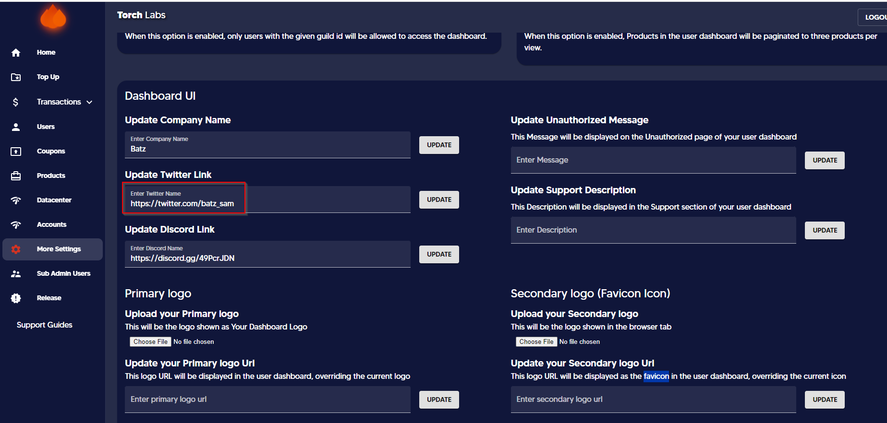
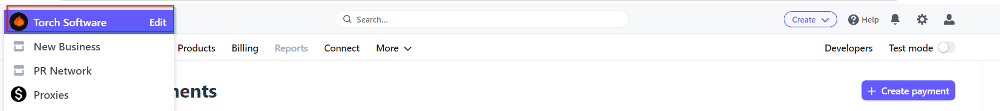

# 🌀 Updating & Hiding Twitter


This section will guide you on how to update your Twitter link to appear on the user dashboard. Additionally, the guide provides an option to remove the Twitter icon from the user dashboard.


#### Updating Twitter Link

1. Go to Admin Dashboard and click on More Settings

<figure><figcaption></figcaption></figure>

2\. Enter the Twitter Link under the Dashboard UI section and click Update.

<figure><figcaption></figcaption></figure>

_Twitter will be appeared on the user dashboard as follows_

<figure><figcaption></figcaption></figure>

#### Removing Twitter Icon


If you do not have a Twitter account or are not using Twitter as one of your social media tools, you can hide this icon from the user dashboard.


1. Go to Admin Dashboard and click on More Settings
2. Click on the _hide Twitter icon_ button

<figure><figcaption></figcaption></figure>

_Twitter will be hidden on the user dashboard as follows_

<figure><figcaption></figcaption></figure>
