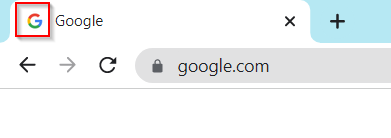

# ➰ Uploading Secondary Logo


In this section, we will provide guidance on how to upload a secondary logo. The secondary logo is a simplified version of the primary logo that will appear on the tab when the website is opened using a search engine.


1. Go to Admin Dashboard and click on More Settings

<figure><figcaption></figcaption></figure>

2\. Click on _Choose file_ under Dashboard UI section and upload your secondary logo

<figure><figcaption></figcaption></figure>

_The logo will be appeared as follows (i.e. Google)_

<figure><figcaption></figcaption></figure>

