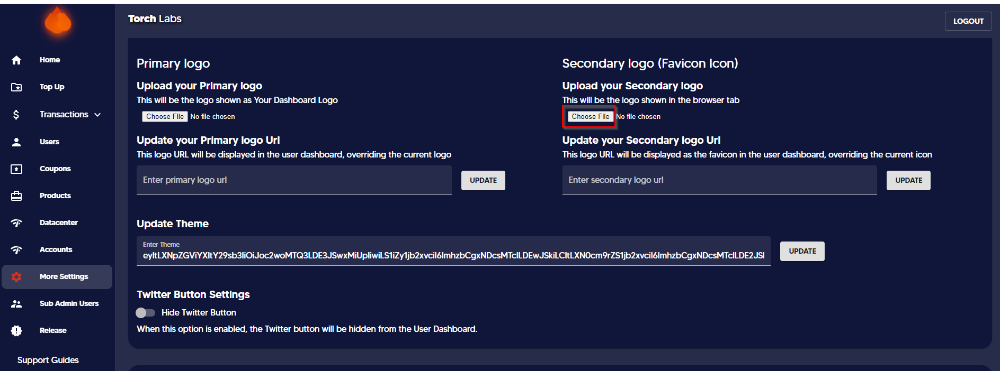

# ➰ Uploading Secondary Logo


In this section, we will provide guidance on how to upload a secondary logo. The secondary logo is a simplified version of the primary logo that will appear on the tab when the website is opened using a search engine.



Once you upload the logo it might take a few hours for the logo to appear on the dashboard.


1. Go to Admin Dashboard and click on More Settings

<figure><figcaption></figcaption></figure>

2\. Click on _Choose file_ under the Dashboard UI section and upload your secondary logo

<figure><figcaption></figcaption></figure>

3. Enter the secondary logo URL&#x20;


This step is required only for those who want to white-label the secondary logo URL. This logo URL will be displayed as the favicon on the user dashboard, replacing the current logo.

Or else you can keep this space empty to have your current logo with the default URL.


<figure><figcaption></figcaption></figure>

_The logo will appear as follows (i.e. Google)_

<figure><figcaption></figcaption></figure>

