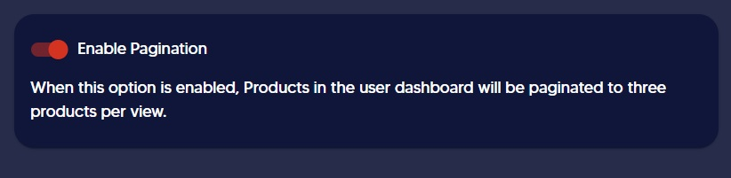

# 🖇 Enabling pagination


Products in the user dashboard will be paginated to three products per view by enabling this option.


Normally all the products under a one category shows one after the other on the dashboard.

.png>)

You can enable the option of _**enable pagination**_ to have maximum of 03 products per page as follows

.png>)
