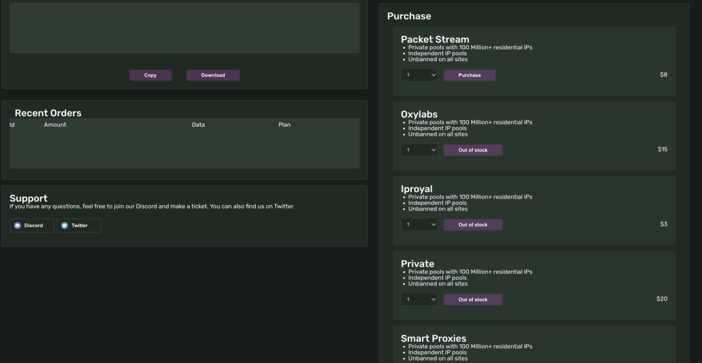
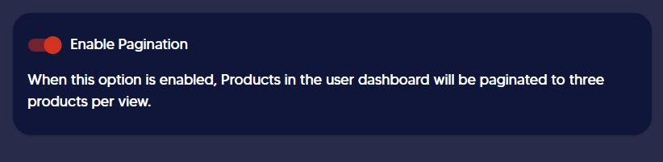
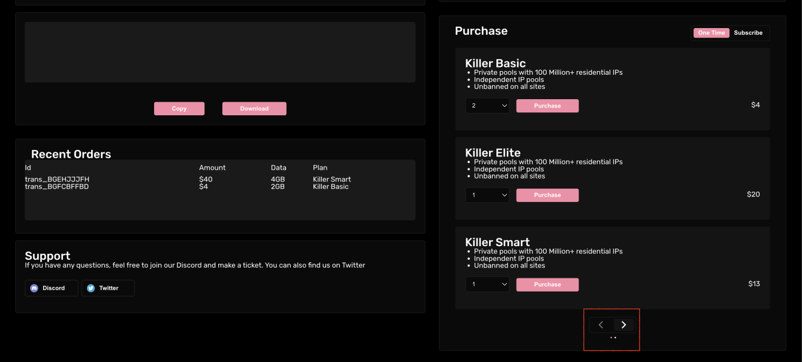

# 🖇️ Enabling pagination


Products in the user dashboard will be paginated to three products per view by enabling this option.


Normally all the products under one category show one after the other on the dashboard.

You can enable the option of _**enable pagination**_ to have a maximum of 03 products per page as follows

