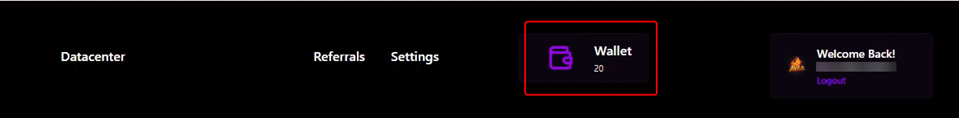

# How to Display Promotional Messages in the User Dashboard

## Overview

As an admin, you can create and manage promotional messages that will be displayed on user dashboards. This feature enables you to effectively communicate special offers, updates, or important announcements directly to your users, keeping them informed and engaged with your platform. The messages you submit will be visible under the "One-Time" and "Subscription" tabs in the user dashboard, ensuring they reach the intended audience promptly.

<figure><figcaption></figcaption></figure>

### Steps to Add Promotional Message

1. Log in to the Admin Dashboard and navigate to the **More Settings** Tab. Then Scroll all the way down and there is a region named **Promotional Message**.

<figure><figcaption></figcaption></figure>

2. Here, you can insert the required message in the **Enter Messag**e Text box. It is important to remember that the Promotional Message must be less than 50 characters. Once you add the Promotional Message, click on the **Save** Button.

<figure><figcaption></figcaption></figure>

3. Once it is submitted successfully, the below popup will appear.

<figure><figcaption></figcaption></figure>

4. When the user logs in to their dashboard, the submitted Promotional Message will appear as shown in the image below.

<figure><figcaption></figcaption></figure>
