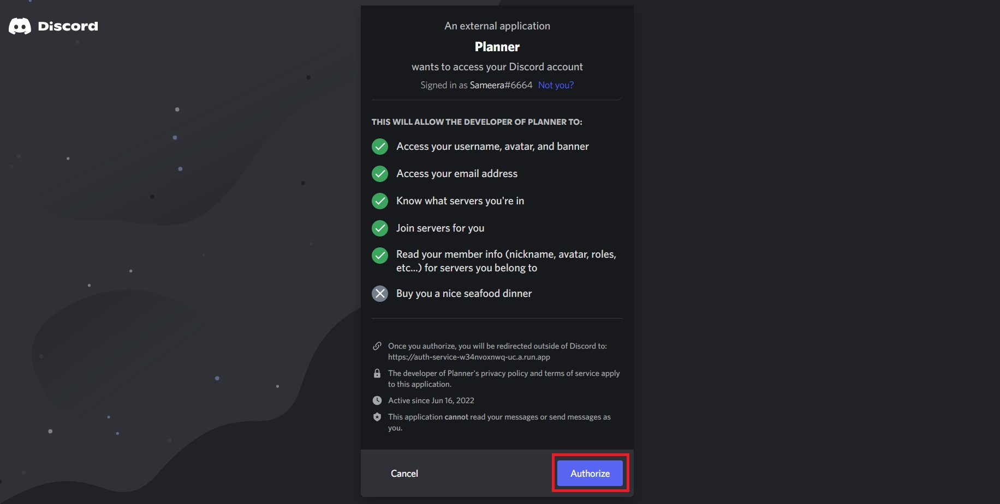

# 🛡 Restrict dashboard access


You can always restrict or provide access to the ones you want to give, To have more control over the dashboard follow the below steps. According to the restricted access, it is a must to match the condition of being in the server and having a role both to be authorized the access.


1. Go to the admin dashboard scroll below and click more settings and disable restricted access.

.jpg>)

2\. Go to Discord right-click the server and you will find the copy server.

.jpg>)

> If you dont find this option to copy id please follow this link [https://www.howtogeek.com/714348/how-to-enable-or-disable-developer-mode-on-discord/](https://www.howtogeek.com/714348/how-to-enable-or-disable-developer-mode-on-discord/)&#x20;

3\. Paste it on enter guild ID and update it.&#x20;

4\. You can also restrict access to the dashboard by a customer's role. To do this go to discord server settings, select the roles and then click the 3 dots next to the particular role to copy the ID.

5\. Enter role ID and update it.

6\. Then you can update the message that you want to appear on the screen if someone makes unauthorized access. (i.e. You can include the server invite link for anyone interested in joining the server)

<figure><figcaption></figcaption></figure>

&#x20;7\. Finally, you can test it by login to your dashboard

8\. You will get this popup. If you have included any message as mentioned in step 6 that will also appear here.

 (1).png>)
