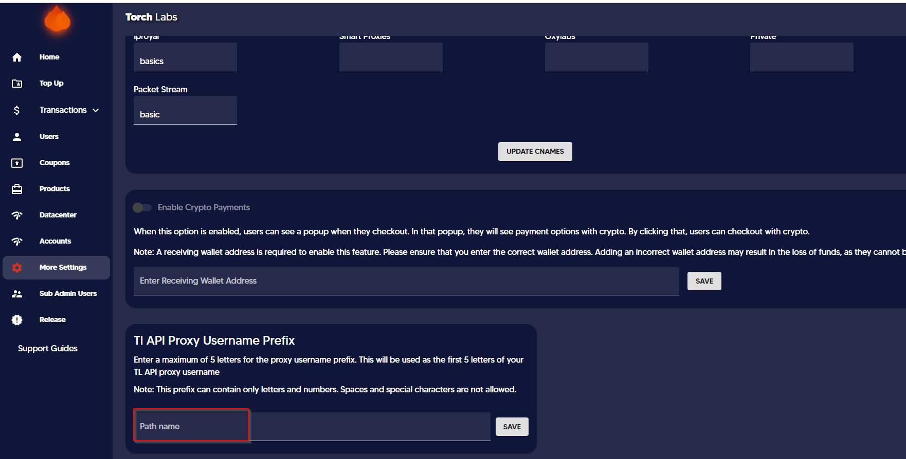

# 🔱 Setting a prefix for TL ISPs


This guide would help you to set up 5 letter prefix for TL ISPs


1. Go to More Settings and scroll down to find the TL API Proxy Username Prefix section

<figure><figcaption></figcaption></figure>

2. Enter a maximum of 5 letters for the proxy username prefix and click Save. This will be used as the first 5 letters of your TL API proxy username


This prefix can contain only letters and numbers. Spaces and special characters are not allowed.


<figure><figcaption></figcaption></figure>

