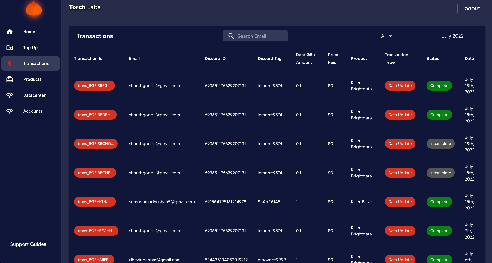
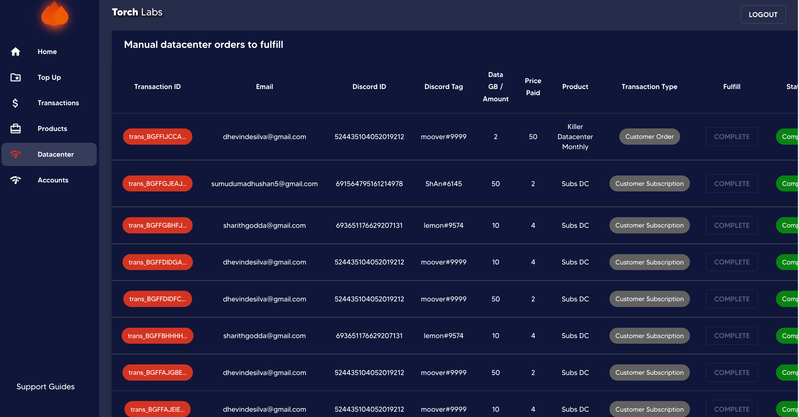
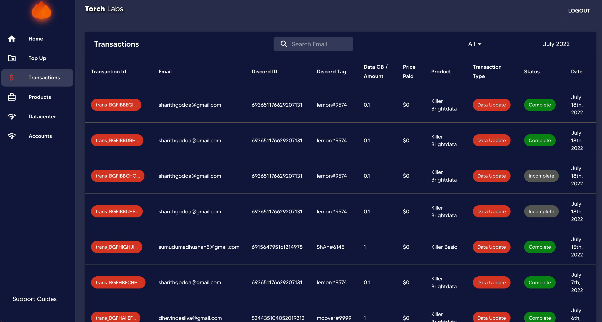
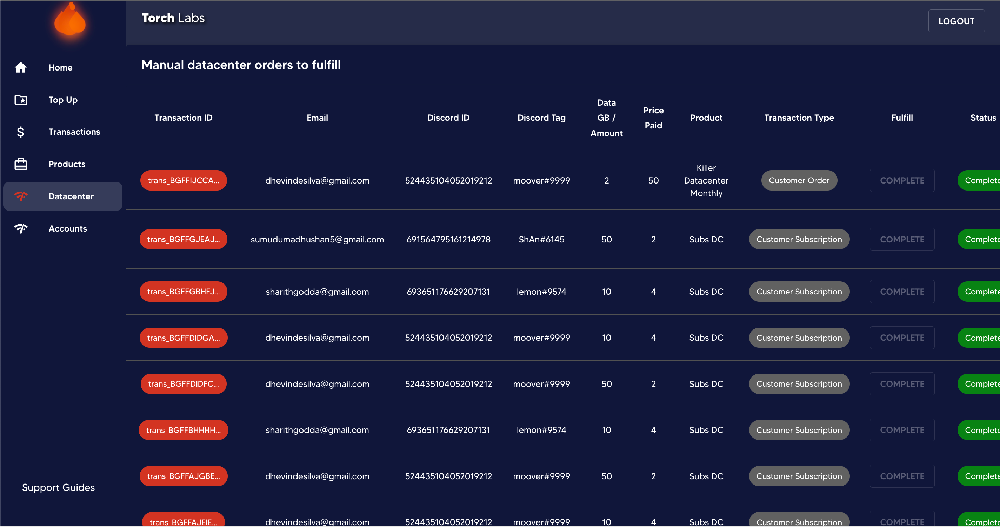
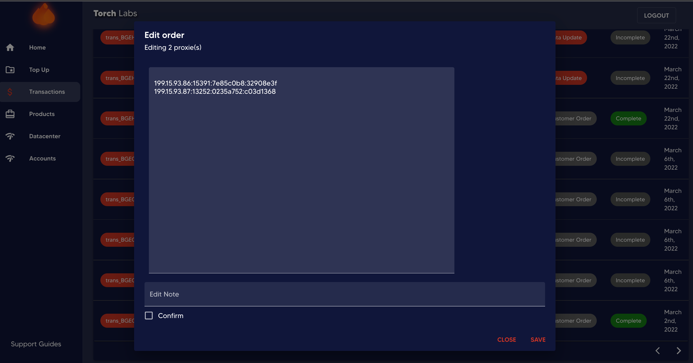
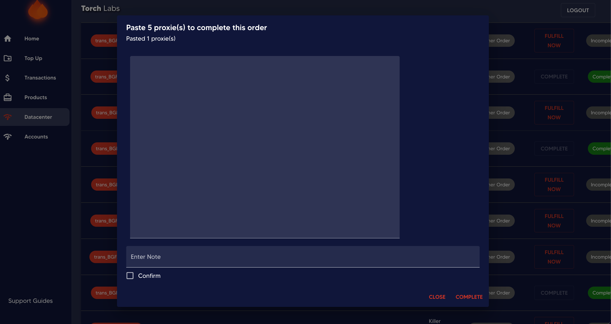
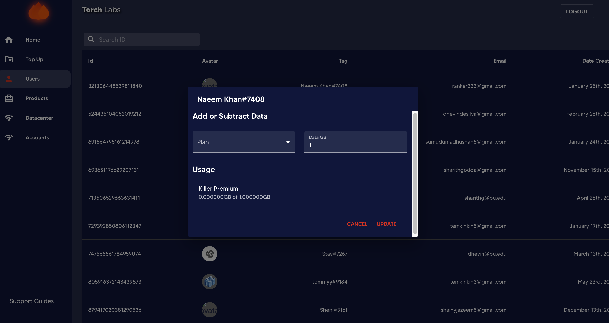
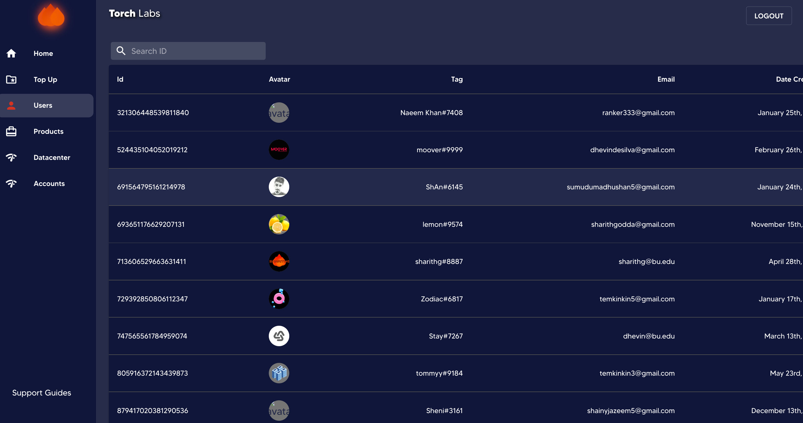
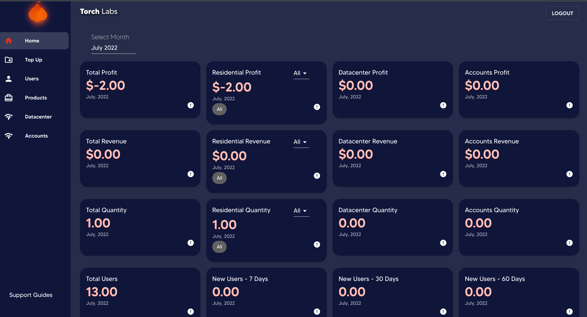

# ⛳ Permissions

* `all_residential` , `all_datacenter`, `all_accounts`

These permissions allow users to view, edit, delete, and sync residential, datacenter, and accounts products. Also allows to create a batch for datacenter and accounts

<figure><figcaption>
All Products
</figcaption></figure>

<figure><figcaption>
Sync Products
</figcaption></figure>

<figure><figcaption>
Create Batches
</figcaption></figure>

* `view_residential` , `view_datacenter`, `view_accounts`

These permissions allow users to view only residential, datacenter, and accounts products.

<figure><figcaption></figcaption></figure>

<figure><figcaption></figcaption></figure>

* `create_residential` , `create_datacenter`, `create_accounts`

These permissions allow users to sync a residential, datacenter, and accounts products. and also user needs view permission for products to create.

* `update_residential` , `update_datacenter`, `update_accounts`

These permissions allow users to enable and disable residential, datacenter, and accounts products, create batches for datacenter and accounts and edit the description of all products. Also users need view permission for products to update.

<figure><figcaption></figcaption></figure>

<figure><figcaption></figcaption></figure>

* `all_coupons`

This permission allows users to view, create, and delete coupons.

<figure><figcaption></figcaption></figure>

* `view_coupons`

This permission allows users to only view coupons.

<figure><figcaption></figcaption></figure>

* `create_coupons`

This permission allows users to create coupons. also users need `view_coupons` permission to create.

<figure><figcaption></figcaption></figure>

* `delete_coupons`

This permission allows users to delete coupons. also users need `view_coupons` permission to delete.

<figure><figcaption></figcaption></figure>

* `all_transactions`

This permission allows users to view, create, update and delete transactions.

<figure><figcaption>
All Transactions
</figcaption></figure>

<figure><figcaption>
Manual Datacenter orders to fulfill
</figcaption></figure>

* `view_transactions`

This permission allows users to only view Transactions.

<figure><figcaption></figcaption></figure>

<figure><figcaption></figcaption></figure>

* `update_transactions`

This permission allows users to update Transactions and fulfill orders. also users need `view_transactions` permission to update.

<figure><figcaption></figcaption></figure>

<figure><figcaption></figcaption></figure>

* `delete_transactions`

This permission allows users to delete Transactions. also users need `view_transactions` permission to delete.

<figure><figcaption></figcaption></figure>

* `all_users`

This permission allows users to view and update User Dashboard Discord users.

<figure><figcaption></figcaption></figure>

* `view_users`

This permission allows users to only view User Dashboard Discord users.

<figure><figcaption></figcaption></figure>

* `update_users`

This permission allows users to Add or Subtract the Data Balance of each plan of User Dashboard Discord users. also, users need `view_users` permission to Update.

<figure><figcaption></figcaption></figure>

* `view_analytics`

This permission allows users to view Analytics.

<figure><figcaption></figcaption></figure>
