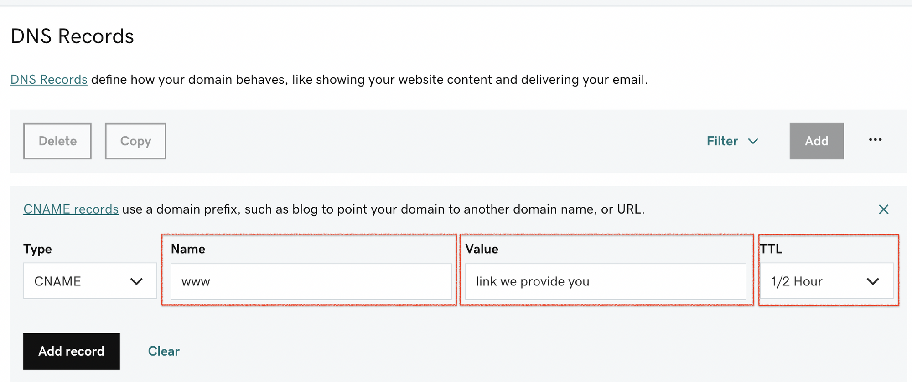

# ✈ Adding Your Site To Your Domain


If you’re looking to connect your GoDaddy domain to your website you will need two things: a domain, and a hosting account. The hosting account (or server) is where your website will live. GoDaddy is where you might buy your domain and in orde to connect your domain with site follow the below steps.


## Godaddy Setup

1. Go to your Domain provider's DNS settings

Godaddy:[https://www.godaddy.com/help/what-is-dns-665](https://www.godaddy.com/help/what-is-dns-665)

2\. Create a C Name Record pointing to the domain.

3\. In the Name/host section add "www" what this does is we are adding www in front of your domain. So it will be [www.yourdomain.com](http://www.yourdomain.com)


If you already have a landing page that is occupying your WWW cname, you can put your site on a different cname such as "dashboard". What this will do is your dashboard will now live on the dashboard.domain.com. If you decide to do this, **please SKIP steps 6 to 9.**&#x20;


4\. In the value/points to section, add the link we have provided you on discord. We will provide you with a link that we host on our backend which will be a randomized link. So to point your newly bought domain, you must point that domain to the link we have provided you.

5\. TTL can be anything you want. We recommend a shorter TTL since it is basically how long it takes for the changes to go into effect.

6\. Next, we need to create an A record in the DNS settings.

.png>)

7\. In the Name/host section add your domain only. Do not add www or https just the domain.

8\. In the value/points to section, add: **75.2.60.5**

9\. TTL can be anything you want. We recommend a shorter TTL since it is basically how long it takes for the changes to go into effect.

10\. That's it! Your site should be good to go in a couple of hours after the changes have gone into effect. 🎉

## **NameCheap / Google Setup**

1. Go to your Domain provider's DNS settings

NameCheap:[https://www.namecheap.com/support/knowledgebase/article.aspx/767/10/how-to-change-dns-for-a-domain/](https://www.namecheap.com/support/knowledgebase/article.aspx/767/10/how-to-change-dns-for-a-domain/)

2\. Create a C Name Record pointing to the domain.

<figure><figcaption></figcaption></figure>

3\. In the Name/host section add "www" what this does is we are adding www in front of your domain. So it will be [www.yourdomain.com](http://www.yourdomain.com)


If you already have a landing page that is occupying your WWW cname, you can put your site on a different cname such as "dashboard". What this will do is your dashboard will now live on the dashboard.domain.com. If you decide to do this, **please SKIP steps 6 to 9.**&#x20;


4\. In the value/points to section, add the link we have provided you on discord. We will provide you with a link that we host on our backend which will be a randomized link. So to point your newly bought domain, you must point that domain to the link we have provided you.

5\. TTL can be anything you want. We recommend a shorter TTL since it is basically how long it takes for the changes to go into effect.

6\. Next, we need to create an A record in the DNS settings.

<figure><figcaption></figcaption></figure>

7\. In the Name/host section add your domain only. Do not add www or https just the domain.

8\. In the value/points to section, add: **75.2.60.5**

9\. TTL can be anything you want. We recommend a shorter TTL since it is basically how long it takes for the changes to go into effect.

10\. Make the below record exactly as shown:

Create an **ALIAS Record**

<figure><figcaption></figcaption></figure>

11\. That's it! Your site should be good to go in a couple of hours after the changes have gone into effect. 🎉
