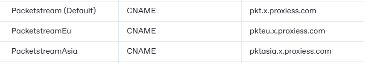
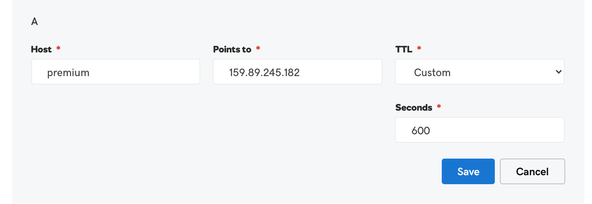

# 〽️ White labeling proxies with your domain


This process allows you to brand the proxies with your company name. For example, if you are using packet stream the default proxies will have [packetstream.io](http://packetstream.io) in the name. However, using the following guide you can use your domain instead to brand the proxies.


#### Quick Domain Links


Please make sure to have two different names for the default and EU products (i.e. Oxylabs , Smart) when entering to DNS settings. Having the same name for the different products may lead to generating non-functioning proxies.&#x20;


| API                    | Record Type | Domain                                   |
| ---------------------- | ----------- | ---------------------------------------- |
| Smartproxies (Default) | CNAME       | smrt.x.proxiess.com                      |
| SmartEU                | CNAME       | smrteu.x.proxiess.com                    |
| Oxylabs (Default)      | CNAME       | oxy.x.proxiess.com                       |
| OxylabsEU              | CNAME       | oxyeu.x.proxiess.com                     |
| IPRoyal (Default)      | CNAME       | iproyal.x.proxiess.com                   |
| IPRoyalEU              | CNAME       | iproyaleu.x.proxiess.com                 |
| IPRoyalasia            | CNAME       | iproyalasia.x.proxiess.com               |
| Packetstream (Default) | CNAME       | pkt.x.proxiess.com                       |
| PacketstreamEu         | CNAME       | pkteu.x.proxiess.com                     |
| PacketstreamAsia       | CNAME       | pktasia.x.proxiess.com                   |
| Private                | A           | 159.89.245.182                           |
| Brightdata (Default)   | CNAME       | brd.x.proxiess.com                       |
| Brightdata EU          | CNAME       | brdeu.x.proxiess.com                     |
| Brightdata Asia        | CNAME       | brdasia.x.proxiess.com                   |
| Geonode                | CNAME       | premium-residential.geonode.com          |
| X Residential          | CNAME       | Refer "White Labeling the X Residential" |

**X Residential**

This guide outlines the white labeling process for **X Residential**.


[white-labeling-the-x-residential.md](white-labeling-the-x-residential.md)


#### PacketStream

Use this method to brand your proxies with your own domain/company name

To brand the proxies under your domain follow these steps:

1. Open the DNS configuration for your domain.
2. Create a CNAME Record pointing to the domain.
3. Whatever you enter in the name/host will decide the domain which points to our API IP.
4. Thus if your domain is [API.com](http://api.com/) and you enter the host premium or whatever you want to call it pointing to the PacketStream domain, your proxies will be formatted [premium.yourdomain.com](http://premium.yourdomain.com/):port:user:pass
5. An example on Godaddy is linked below:

<figure><figcaption></figcaption></figure>

#### Private Resis

Use this method to brand your proxies with your own domain/company name

To brand the proxies under your domain follow these steps:

1. Open the DNS configuration for your domain.
2. Create a Name Record pointing to the domain {**159.89.245.182}**.
3. Whatever you enter in the name/host will decide the domain which points to our API IP.
4. Thus if your domain is [API.com](http://api.com/) and you enter the host premium pointing to the oxylabs domain, your proxies will be formatted [premium.yourdomain.com](http://premium.yourdomain.com/):port:user:pass
5. An example on Godaddy is linked below:

#### Oxylabs

Use this method to brand your proxies with your own domain/company name

To brand the proxies under your domain follow these steps:

1. Log in to your domain hosting provider account and navigate to the DNS management section.
2. Locate the option to add a new CNAME record for your domain.
3. Enter the desired subdomain as the CNAME record value. For example, if you want your subdomain to be "example," enter "example" as the host.
4. In the "value" field, enter "`oxy.x.proxiess.com`."
5. Save the changes and allow some time for DNS propagation.
6. Your custom oxylabs domain will now be accessible via the URL: `example.mydomain.com`

#### OxylabsEU

Use this method to brand your proxies with your own domain/company name

To brand the proxies under your domain follow these steps:

1. Log in to your domain hosting provider account and navigate to the DNS management section.
2. Locate the option to add a new CNAME record for your domain.
3. Enter the desired subdomain as the CNAME record value. For example, if you want your subdomain to be "example," enter "exampleeu" as the host, appending "eu" at the end. Please note this must be the same value entered for `oxy.x.proxiess.com` with eu at the end.
4. In the "value" field, enter "`oxyeu.x.proxiess.com`."
5. Save the changes and allow some time for DNS propagation.
6. Your custom domain will now be accessible via the URL: `exampleeu.mydomain.com`

#### Smart Proxies

Use this method to brand your proxies with your own domain/company name

To brand the proxies under your domain follow these steps:

1. Log in to your domain hosting provider account and navigate to the DNS management section.
2. Locate the option to add a new CNAME record for your domain.
3. Enter the desired subdomain as the CNAME record value. For example, if you want your subdomain to be "example," enter "example" as the host.
4. In the "value" field, enter "[smrt.x.proxiess.com](http://smrt.x.proxiees.com/)."
5. Save the changes and allow some time for DNS propagation.
6. Your custom domain will now be accessible via the URL: `example.mydomain.com`
7. An example on Godaddy is linked below:

<figure><figcaption></figcaption></figure>

#### SmartEU

1. Log in to your domain hosting provider account and navigate to the DNS management section.
2. Locate the option to add a new CNAME record for your domain.
3. Enter the desired subdomain as the CNAME record value. For example, if you want your subdomain to be "example," enter "exampleeu" as the host, appending "eu" at the end. Please note this must be the same value entered for [smrt.x.proxiees.com](http://smrt.x.proxiees.com/) with eu at the end.
4. In the "value" field, enter "[smrteu.x.proxiess.com](http://smrteu.x.proxiees.com/)."
5. Save the changes and allow some time for DNS propagation.
6. Your custom domain will now be accessible via the URL: `exampleeu.mydomain.com`

#### IP Royal

Use this method to brand your proxies with your own domain/company name

To brand the proxies under your domain follow these steps:

1. Open the DNS configuration for your domain.
2. Create a C Name Record pointing to the domain.
3. Whatever you enter in the name/host will decide the domain which points to our API IP.
4. Thus if your domain is [API.com](http://api.com/) and you enter the host premium or whatever you want to call it pointing to the PacketStream domain, your proxies will be formatted [premium.yourdomain.com](http://premium.yourdomain.com/):port:user:pass
5. An example on Godaddy is linked below:

<figure><figcaption></figcaption></figure>

#### IPRoyalEU

Use this method to brand your proxies with your own domain/company name

To brand the proxies under your domain follow these steps:

1. Log in to your domain hosting provider account and navigate to the DNS management section.
2. Locate the option to add a new CNAME record for your domain.
3. Enter the desired subdomain as the CNAME record value. For example, if you want your subdomain to be "example," enter "exampleeu" as the host, appending "eu" at the end. Please note this must be the same value entered for `iproyaleu.x.proxiess.com` with eu at the end.
4. In the "value" field, enter "`iproyaleu.x.proxiess.com`"
5. Save the changes and allow some time for DNS propagation.
6. Your custom domain will now be accessible via the URL: `exampleeu.mydomain.com`

#### IPRoyalasia

Use this method to brand your proxies with your own domain/company name

To brand the proxies under your domain follow these steps:

1. Log in to your domain hosting provider account and navigate to the DNS management section.
2. Locate the option to add a new CNAME record for your domain.
3. Enter the desired subdomain as the CNAME record value. For example, if you want your subdomain to be "example," enter "exampleasia" as the host, appending "asia" at the end. Please note this must be the same value entered for `iproyalasia.x.proxiess.com` with asia at the end.
4. In the "value" field, enter "`iproyalasia.x.proxiess.com`"
5. Save the changes and allow some time for DNS propagation.
6. Your custom domain will now be accessible via the URL: `exampleasia.mydomain.com`

#### Brightdata

Use this method to brand your proxies with your own domain/company name

To brand the proxies under your domain follow these steps:

1. Open the DNS configuration for your domain.
2. Create a C Name Record pointing to the domain.
3. Whatever you enter in the name/host will decide the domain which points to our API IP.
4. Thus if your domain is [API.com](http://api.com/) and you enter the host premium or whatever you want to call it pointing to the PacketStream domain, your proxies will be formatted [premium.yourdomain.com](http://premium.yourdomain.com/):port:user:pass
5. An example on Godaddy is linked below:

<figure><figcaption></figcaption></figure>

#### Geonode

Use this method to brand your proxies with your own domain/company name

To brand the proxies under your domain follow these steps:

1. Log in to your domain hosting provider account and navigate to the DNS management section.
2. Locate the option to add a new CNAME record for your domain.
3. Enter the desired subdomain as the CNAME record value. For example, if you want your subdomain to be "example," enter "example" as the host.
4. In the "value" field, enter `"premium-residential.geonode.com"`
5. Save the changes and allow some time for DNS propagation.
6. Your custom oxylabs domain will now be accessible via the URL: `example.mydomain.com`
7. An example on Godaddy is linked below:
