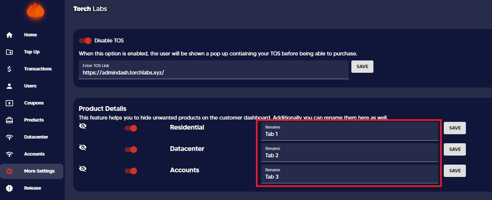

# 📑 Changing / Hiding tab names


This guide will help you to change / hide the products name displayed on the User Dashboard.


Go to more settings on admin dashboard and under product details the product names could be edited as required.&#x20;

.jpg>)

For an example the tab names could be renamed as Tab 1, Tab 2 and Tab 3 as needed.

The above changes would be displayed on the customer dashboard as follows

.jpg>)

By disabling the tabs you can hide the tabs displayed on customer dashboard

<figure><figcaption></figcaption></figure>
