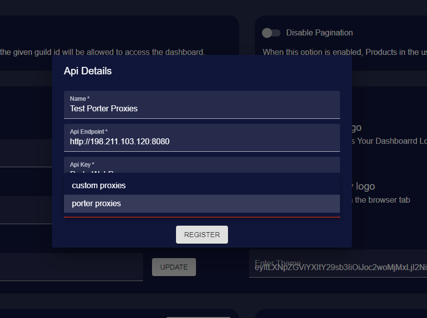
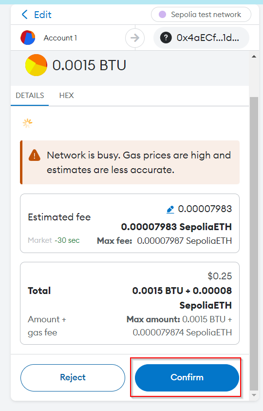
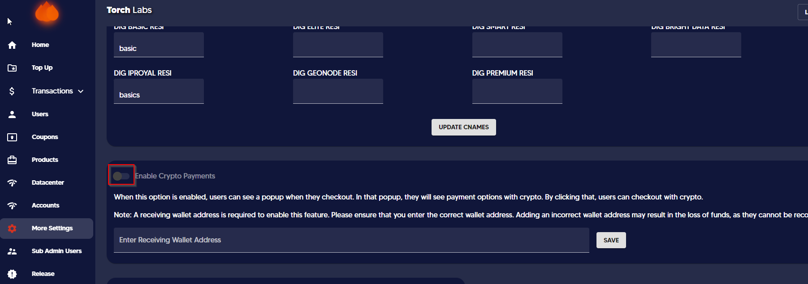
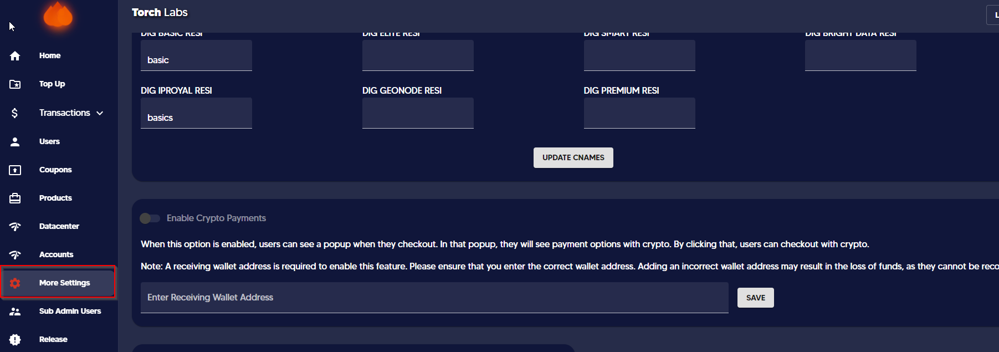

# Proxy Generation


In this segment, you'll receive direction on the choices and capabilities accessible during proxy generation.&#x20;

Our dashboard provides customers with a range of options for generating different formats, which is great for flexibility. Additionally, the ability to target proxies by country, state, and city allows customers to optimize proxy usage for specific geographic locations. This can be particularly useful for businesses that have a strong local presence and need to gather data from specific regions. Overall, these features provide customers with greater control and customization options, which can ultimately lead to more efficient and effective use of proxies.


1. Click on the "Proxies" tab and then click on the Residential Proxies sub-tab.


The proxies cannot be generated unless a sub-user is created. If you have not created a sub-user you will see a screen as follows.


<figure><figcaption></figcaption></figure>

In creating a sub-user / reseller please click on the "Reseller" link.

<figure><figcaption></figcaption></figure>


[create-sub-users.md](sub-users/create-sub-users.md)


2. Click on the drop-down of providers and select the required provider.

<figure><figcaption></figcaption></figure>

3. Select the sub-user

<figure><figcaption></figcaption></figure>

4. Select the country. You can choose multiple countries and generate the proxies.

<figure><figcaption></figcaption></figure>

4.1 If you select the country as USA (United States of America) then you get the option of clicking on _Advance Settings_ only for Oxylabs , Smart and IPRoyal.&#x20;

<figure><figcaption></figcaption></figure>

4.2 If you select IPRoyal as the Proxy pool and select the country as the USA, it is able to generate state-level proxies by clicking _Advance settings._

<figure><figcaption></figcaption></figure>

4.3 If you select Oxylabs or Smart as the Proxy provider and select the country as the USA, it can generate either state-level or city-level proxies by clicking _Advance settings._ But it is not possible to select both state and city. Once you select the State, automatically the city selection gets disabled and vice versa.

<figure><figcaption></figcaption></figure>

5. If you select Packetstream as the proxy provider, then you get the SSL option. Selecting _Yes_ would make you have proxies with a secure session where the proxies include http / https in the URL domain.

<figure><figcaption></figcaption></figure>

6. Then enter the number of Proxies to be generated.

<figure><figcaption></figcaption></figure>

7. Select the Proxy type (i.e. Sticky or Rotating)

<figure><figcaption></figcaption></figure>

8. Once the proxies are generated you can either copy or download the proxies.

<figure><figcaption></figcaption></figure>
