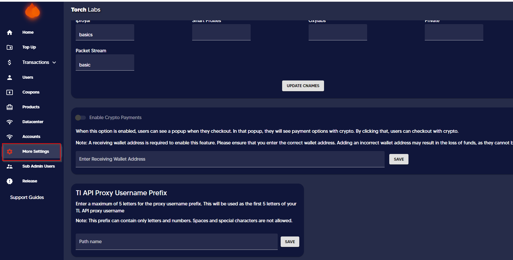

# Purchase Reseller Credits


This guide explains how to purchase credits for allocating data among providers and sub-users.


1. Click on the "Purchase" tab and then select the "Residential Proxies" sub-tab

<figure><figcaption></figcaption></figure>

2. Select "Pay-as-you-go" section

<figure><figcaption></figcaption></figure>

3. Select the number of credits required to be purchased by dragging the button on account credits


1 Credit = 1$


<figure><figcaption></figcaption></figure>

4. Then click on the Purchase button.

<figure><figcaption></figcaption></figure>
