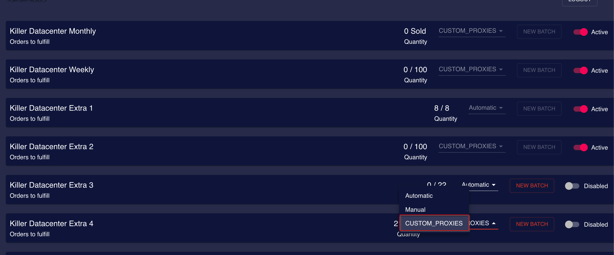

# Subscribe to Residential plan


This section provides information on how to subscribe to a recurring product. You have the option to select the desired provider and purchase the required data accordingly.


1. Click on the "Purchase" tab and then select the "Residential Proxies" sub-tab

<figure><figcaption></figcaption></figure>

2. Click on the Subscribe section

<figure><figcaption></figcaption></figure>

3. Select the quantity to be subscribed based on the required product.

<figure><figcaption></figcaption></figure>

4. Then click on the Subscribe button&#x20;

<figure><figcaption></figcaption></figure>

5. Click on the view order button to check if you have made orders previously

<figure><figcaption></figcaption></figure>

5.1 This is how it looks like when you click on the View Order

<figure><figcaption></figcaption></figure>
