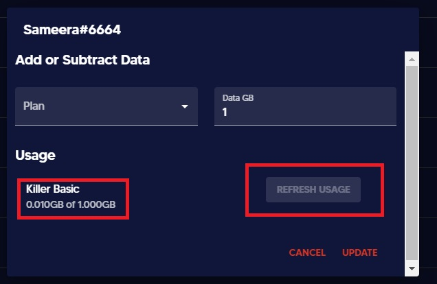

# ⏳ View users current balance


This guide will help to keep track of your user's current balance for each of the user's plans.


​1. In the _**Users**_ tab, find your desired user.

2\. When you click on the user, after a few seconds once the pop up appears, it will contain the users existing balance for each of their plans. There is a button called "Show usage" which will lead you to get the usage of data of each user.

.jpg>)

Every 10 seconds usage could be refreshed and get the updated usage of each user.

