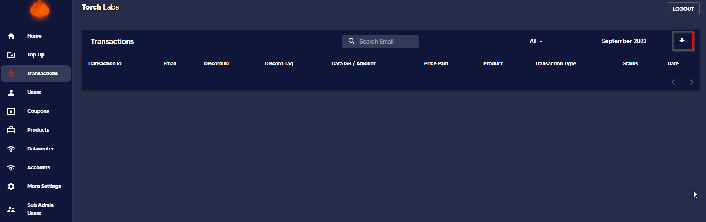

# Create Sub-users

1. Click on the "Sub-users" tab&#x20;


All the sub-users are displayed in this section along with their user ID, plan name, and created date.


<figure><figcaption></figcaption></figure>

2. Next, click on the Create User button.

<figure><figcaption></figcaption></figure>

3. Select the provider from the drop-down list.

<figure><figcaption></figcaption></figure>

4. Then add/remove data

<figure><figcaption></figcaption></figure>

5. Finally, click the Create button

<figure><figcaption></figcaption></figure>
